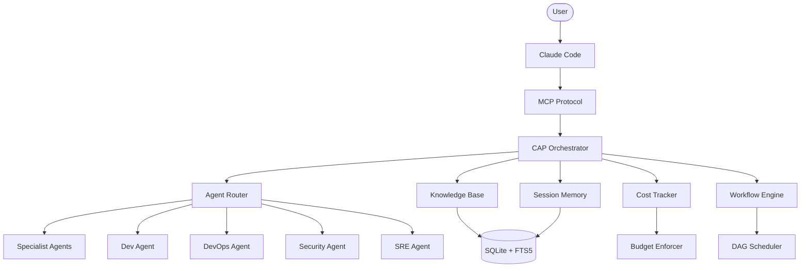

# Claude Agent Platform (CAP)

Production-grade multi-agent orchestration platform for Claude Code.

## Architecture



## Quick Start

```bash
# Install (choose one)
pip install -e .
uv pip install -e .

# Initialize databases, config, and MCP server registration
cap init

# Verify all systems are operational
cap health
```

After initialization, CAP is automatically active in every Claude Code session via MCP.

## Features

- **10 MCP Servers** -- Knowledge, Session, Orchestrator, Harness, Backlog, Workflow, Code Intel, AST, Fleet, and Diagram servers running concurrently
- **Non-Blocking Orchestration** -- Fire-and-forget task dispatch with async result polling; never blocks the Claude Code session
- **Cost Tracking** -- Per-task and monthly budget caps with automatic kill on overspend; tracks token usage across all providers
- **Knowledge Graph** -- Hybrid retrieval combining FTS5 keyword search, vector similarity, and entity-relationship graph traversal
- **Session Memory** -- Decisions, corrections, and learnings persist across sessions with relevance-scored recall
- **Workflow Engine** -- DAG-based multi-step execution with parallel branches, checkpoints, and resumability
- **Agent Routing** -- Complexity-tiered dispatch across 139 specialist agents with progressive autonomy tracking
- **Blast Radius Analysis** -- Pre-execution dependency traversal to assess cross-service impact before changes
- **Self-Healing Infrastructure** -- Health monitoring with automatic server restart on failure detection
- **AST Code Search** -- Structural pattern matching via ast-grep for language-aware code navigation

## Non-Blocking Mode

CAP orchestration is non-blocking by default. Dispatch a task and poll for results without stalling the session:

```python
# Dispatch a task (returns immediately with a task ID)
result = cap_orchestrate(
    task="Refactor authentication module to use JWT tokens",
    agents=["dev", "security"],
    budget_limit_usd=0.50
)
task_id = result["task_id"]
# => {"task_id": "wf-a1b2c3", "status": "running"}

# Poll for completion
status = cap_result(task_id=task_id)
# => {"status": "running", "progress": "2/3 agents complete", "elapsed_s": 12.4}

# Final result (once status is "complete")
status = cap_result(task_id=task_id)
# => {"status": "complete", "output": {...}, "cost_usd": 0.03, "duration_s": 18.7}
```

## Configuration

CAP stores its configuration in `~/.claude-platform/harness-config.json`. Key settings:

| Key | Type | Description |
|:----|:-----|:------------|
| `provider` | string | LLM backend: `"bedrock"`, `"anthropic"`, or `"local"` |
| `model_id` | string | Model identifier (e.g., `"us.anthropic.claude-sonnet-4-20250514"`) |
| `budget_monthly_usd` | number | Monthly spend cap in USD; tasks are killed when exceeded |
| `budget_per_task_usd` | number | Maximum cost allowed for a single orchestrated task |
| `max_concurrent_agents` | number | Parallel agent execution limit (default: 5) |
| `knowledge_db_path` | string | Path to the SQLite knowledge database |
| `session_db_path` | string | Path to the session memory database |
| `auto_index_on_init` | boolean | Whether `cap init` triggers workspace indexing |
| `health_check_interval_s` | number | Seconds between MCP server health checks |
| `github_org` | string | GitHub organization for auto-resolution of dependencies |
| `github_use_ssh` | boolean | Use SSH URLs for git clone operations (default: true) |

Example configuration:

```json
{
  "provider": "bedrock",
  "model_id": "us.anthropic.claude-sonnet-4-20250514",
  "budget_monthly_usd": 50.00,
  "budget_per_task_usd": 2.00,
  "max_concurrent_agents": 5,
  "knowledge_db_path": "~/.claude-platform/knowledge.db",
  "session_db_path": "~/.claude-platform/sessions.db",
  "auto_index_on_init": true,
  "health_check_interval_s": 30,
  "github_org": "moia-oss",
  "github_use_ssh": true
}
```

## Comparison

| Capability | CAP | CrewAI | LangGraph | AutoGen |
|:-----------|:---:|:------:|:---------:|:-------:|
| Install steps | 2 (`pip install` + `cap init`) | 1 (`pip install`) | 1 (`pip install`) | 1 (`pip install`) |
| Async orchestration | Yes (non-blocking MCP) | No (sequential) | Partial (async nodes) | Partial (async chat) |
| MCP native | Yes (10 servers) | No | No | No |
| Cost tracking | Built-in per-task + monthly | Manual | Manual | Manual |
| Claude-optimized | Yes (prompt tuning, routing) | Generic | Generic | Generic |
| Agent routing | Complexity-tiered (139 agents) | Role-based | Graph edges | Conversation |
| Session memory | Persistent cross-session | Per-run only | Checkpointer | Per-run only |
| Knowledge graph | FTS5 + vector + graph | None | None | None |
| Workflow engine | DAG with parallel branches | Sequential crew | State graph | Group chat |
| Self-healing | Auto-restart on failure | No | No | No |

## Project Structure

```
claude-agent-platform/
├── src/cap/
│   ├── __init__.py
│   ├── __main__.py
│   ├── config.py                 # Configuration management
│   ├── db.py                     # SQLite database layer
│   ├── cli/                      # CLI commands (cap init, cap health, etc.)
│   ├── code_intel/               # Code understanding and indexing
│   ├── cost/                     # Budget tracking and enforcement
│   ├── data/
│   │   ├── agents/               # Agent definitions and prompts
│   │   ├── harness/              # Harness configuration templates
│   │   └── workflows/            # Workflow DAG definitions
│   ├── enforcement/              # Policy and governance enforcement
│   ├── eval/                     # Evaluation framework and test suites
│   ├── harness/                  # Agent execution harness
│   ├── health/                   # Health monitoring and auto-recovery
│   ├── hooks/                    # Pre/post task hooks
│   ├── integrity/                # Data integrity checks
│   ├── learning/                 # Feedback loop and trust scoring
│   ├── lib/                      # Shared utilities
│   ├── memory/                   # Session memory with eviction/consolidation
│   ├── orchestration/            # Task decomposition and routing
│   ├── reliability/              # Circuit breakers and retry logic
│   ├── runtime/                  # Agent runtime environment
│   ├── servers/                  # MCP server implementations
│   │   ├── ast_server.py
│   │   ├── backlog_server.py
│   │   ├── code_intel_server.py
│   │   ├── diagram_server.py
│   │   ├── fleet_server.py
│   │   ├── harness_server.py
│   │   ├── knowledge_server.py
│   │   ├── orchestrator_server.py
│   │   ├── session_server.py
│   │   └── workflow_server.py
│   └── sync/                     # Repository sync and indexing
├── tests/                        # Unit and integration tests
├── scripts/                      # Installation and verification scripts
├── docs/                         # Extended documentation
├── pyproject.toml
└── LICENSE
```

## Contributing

1. Fork the repository
2. Create a feature branch: `git checkout -b feature/your-feature`
3. Make your changes with tests: `pytest tests/`
4. Ensure linting passes: `ruff check src/`
5. Commit with a descriptive message
6. Open a Pull Request against `main`

All contributions must include tests for new functionality and pass the existing test suite. Security-sensitive changes require review from a second maintainer.

## License

MIT License. See [LICENSE](LICENSE) for details.
