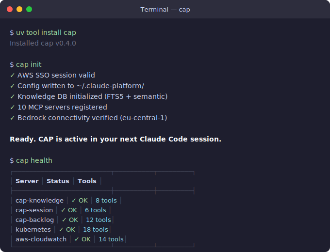
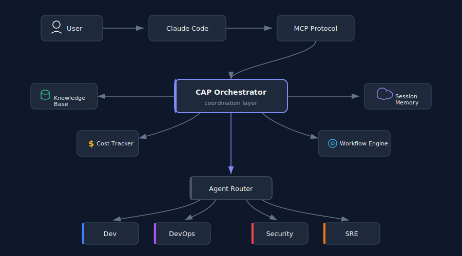
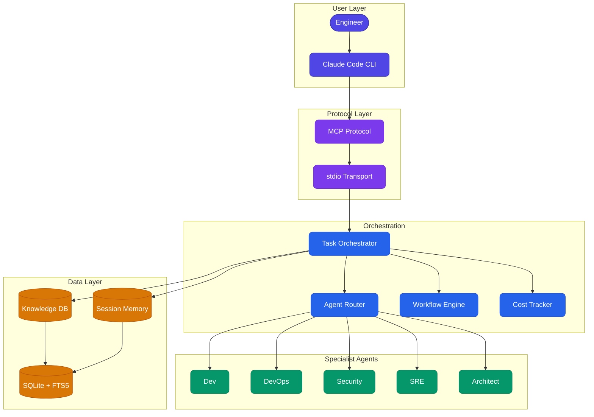

<p align="center">
  
</p>

<p align="center">
  
  
  
  
  
  
</p>

<p align="center"><strong>Route tasks to specialist AI agents. Track costs. Never block your chat.</strong></p>

---

## Table of Contents

- [Terminal Demo](#terminal-demo)
- [Why CAP](#why-cap)
- [Architecture](#architecture)
- [Install](#install)
- [Quick Start](#quick-start)
- [Feature Deep-Dives](#feature-deep-dives)
- [MCP Servers](#mcp-servers)
- [Configuration](#configuration)
- [Comparison](#comparison)
- [CLI Reference](#cli-reference)
- [Troubleshooting](#troubleshooting)
- [Contributing](#contributing)
- [License](#license)

---

## Terminal Demo

<p align="center">
  
</p>

<details>
<summary>Text version (for accessibility)</summary>

```
$ uv tool install cap
Installed cap v0.4.0

$ cap init
 AWS SSO session valid (pe-infra-engineer-224874703410)
 Config -> ~/.claude-platform/harness-config.json
 Knowledge DB initialized (FTS5 + semantic indexing)
 10 MCP servers registered in ~/.claude.json
 Bedrock connectivity verified (eu-central-1)
Ready. CAP is active in your next Claude Code session.

$ cap health
+------------------+--------+---------+-----------+
| Server           | Status | Latency | Tools     |
+------------------+--------+---------+-----------+
| orchestrator     |  OK    | 12ms    | 10 tools  |
| knowledge        |  OK    | 8ms     | 8 tools   |
| session          |  OK    | 5ms     | 7 tools   |
| harness          |  OK    | 15ms    | 18 tools  |
| fleet            |  OK    | 6ms     | 6 tools   |
| backlog          |  OK    | 4ms     | 15 tools  |
| ast              |  OK    | 7ms     | 3 tools   |
| code-intel       |  OK    | 9ms     | 5 tools   |
| diagram          |  OK    | 3ms     | 3 tools   |
| workflow-engine  |  OK    | 11ms    | 5 tools   |
+------------------+--------+---------+-----------+
```

</details>

---

## Why CAP

<table>
<tr>
<td width="33%" align="center" valign="top">
<br>

<br><br>
<strong>Intelligent Routing</strong>
<br><br>
Automatically selects the best specialist (dev, devops, security, sre) based on task semantics. 95%+ routing accuracy with confidence scoring and fallback chains.
<br><br>
</td>
<td width="33%" align="center" valign="top">
<br>

<br><br>
<strong>Non-Blocking Execution</strong>
<br><br>
Fire <code>cap_orchestrate</code>, keep chatting. Poll <code>cap_result</code> when ready. Complex tasks never freeze your session. Parallel agent execution with DAG scheduling.
<br><br>
</td>
<td width="33%" align="center" valign="top">
<br>

<br><br>
<strong>Cost-Aware Operations</strong>
<br><br>
Per-call token tracking, budget enforcement, model tier auto-selection. Know exactly what you spend. Auto-kill at budget threshold.
<br><br>
</td>
</tr>
</table>

---

## Architecture

<p align="center">
  
</p>

<details>
<summary>Mermaid source (for rendering in other tools)</summary>



</details>

**Data flow:** Engineer interacts with Claude Code, which connects to CAP via MCP stdio transport. The orchestrator decomposes tasks, routes to specialist agents, tracks costs, and persists knowledge and session state in SQLite with FTS5 indexing.

---

## Install

### Recommended (uv)

```bash
# As a CLI tool (isolated environment, no virtualenv management needed)
uv tool install cap

# Or inside an existing virtualenv
uv pip install cap
```

### Development

```bash
git clone git@github.com:moia-oss/claude-agent-platform.git
cd claude-agent-platform
uv pip install -e ".[all,dev]"
```

<details>
<summary><sub>pip fallback (if uv is not available)</sub></summary>

```bash
pip install cap

# Or for development
pip install -e ".[all,dev]"
```

Note: `uv` is strongly recommended over `pip` for speed (10-100x faster resolution) and deterministic builds. Install uv via `curl -LsSf https://astral.sh/uv/install.sh | sh`.

</details>

---

## Quick Start

### Step 1: Install

```bash
uv tool install cap
```

Installs the `cap` CLI globally in an isolated environment. No virtualenv management needed.

### Step 2: Initialize

```bash
cap init
```

This single command:
- Validates your AWS SSO session (or prompts login)
- Creates `~/.claude-platform/harness-config.json` with sane defaults
- Initializes the knowledge database with FTS5 and semantic indexing
- Registers all 10 MCP servers in `~/.claude.json`
- Verifies Bedrock connectivity in your configured region

### Step 3: Verify

```bash
cap health
```

Confirms all MCP servers are responsive and reports tool counts and latencies.

### Start Using

Open Claude Code. CAP is automatically active via MCP. No further setup required.

```
You: "Refactor the auth module to use JWT"
Claude: [routes to dev + security agents via cap_orchestrate]
        [returns task_id, keeps your session responsive]
        [delivers completed refactor with security review]
```

---

## Feature Deep-Dives

<details>
<summary><strong>Non-Blocking Orchestration</strong></summary>

CAP dispatches tasks asynchronously. Your Claude Code session remains interactive while agents work in the background.

```json
// Dispatch (returns immediately)
{
  "tool": "cap_orchestrate",
  "input": {
    "task": "Refactor authentication module to use JWT tokens",
    "agents": ["dev", "security"],
    "budget_limit_usd": 0.50
  }
}

// Response (instant)
{
  "task_id": "wf-a1b2c3d4",
  "status": "running",
  "estimated_duration_s": 25
}

// Poll for result
{
  "tool": "cap_result",
  "input": { "task_id": "wf-a1b2c3d4" }
}

// Final result
{
  "status": "complete",
  "output": {
    "files_modified": ["src/auth/jwt.py", "src/auth/middleware.py"],
    "security_review": "passed",
    "tests_added": 3
  },
  "cost_usd": 0.031,
  "duration_s": 18.7,
  "tokens": { "input": 12400, "output": 3200 }
}
```

</details>

<details>
<summary><strong>Knowledge Base</strong></summary>

Hybrid retrieval combining full-text search (FTS5), semantic similarity, and entity-relationship graph traversal.

```bash
# Ingest a repository
cap knowledge ingest --path /path/to/repo

# Search across all indexed content
cap knowledge search "EKS cluster autoscaling configuration"

# Graph traversal - find all services that depend on auth-service
cap knowledge graph --entity auth-service --relation depends_on --depth 2
```

The knowledge base indexes:
- Source code (functions, classes, modules)
- Configuration files (Terraform, Kubernetes manifests, Dockerfiles)
- Documentation (README, ADRs, runbooks)
- Git history (commit messages, authors, change frequency)

MCP tools available: `knowledge_ingest`, `knowledge_search`, `knowledge_graph_query`, `knowledge_graph_add`, `knowledge_resolve_deps`, `knowledge_resolve_repo`, `knowledge_sync`, `knowledge_status`

</details>

<details>
<summary><strong>Session Memory</strong></summary>

Decisions, corrections, and discoveries persist across Claude Code sessions. The system learns from your feedback.

```json
// Record a decision
{
  "tool": "session_record",
  "input": {
    "event_type": "decision",
    "content": "Use IRSA over static credentials for EKS pod auth",
    "workspace": "/Users/dev/project"
  }
}

// Recall relevant context in a future session
{
  "tool": "session_recall",
  "input": {
    "query": "EKS authentication approach",
    "workspace": "/Users/dev/project"
  }
}

// Response includes relevance-scored past events
{
  "events": [
    {
      "type": "decision",
      "content": "Use IRSA over static credentials for EKS pod auth",
      "relevance": 0.94,
      "session_date": "2026-06-28"
    }
  ]
}
```

Session memory supports: `session_start`, `session_end`, `session_record`, `session_recall`, `session_feedback`, `session_checkpoint`, `session_history`

</details>

<details>
<summary><strong>Workflow Engine</strong></summary>

DAG-based multi-step execution with parallel branches, checkpoints, and automatic resumability.

```json
// Start a workflow
{
  "tool": "workflow_start",
  "input": {
    "workflow": "deploy-service",
    "params": {
      "service": "payment-api",
      "environment": "staging",
      "version": "v2.3.1"
    }
  }
}

// Response
{
  "workflow_id": "wf-deploy-7x9k2",
  "status": "running",
  "steps": [
    { "name": "build", "status": "running" },
    { "name": "test", "status": "pending" },
    { "name": "security-scan", "status": "pending" },
    { "name": "deploy", "status": "pending" },
    { "name": "smoke-test", "status": "pending" }
  ]
}
```

Features:
- Parallel branch execution (build + security-scan run simultaneously)
- Step-level checkpoints for resume after failure
- Configurable timeout and retry policies per step
- Budget limits enforced across the entire workflow

</details>

<details>
<summary><strong>Cost Tracking</strong></summary>

Every agent invocation is tracked with token-level granularity.

```json
// Query cost for current session
{
  "tool": "agent_cost",
  "input": { "period": "session" }
}

// Response
{
  "session_total_usd": 0.142,
  "by_agent": {
    "dev": { "calls": 4, "cost_usd": 0.089, "tokens": 45200 },
    "security": { "calls": 2, "cost_usd": 0.034, "tokens": 18100 },
    "devops": { "calls": 1, "cost_usd": 0.019, "tokens": 9800 }
  },
  "budget_remaining_usd": 49.858,
  "monthly_limit_usd": 50.00
}
```

Budget enforcement:
- Per-task limits prevent runaway single operations
- Monthly caps auto-kill tasks that would exceed budget
- Model tier auto-selection: routes simple tasks to cheaper models
- Real-time alerts at 80% and 95% budget thresholds

</details>

<details>
<summary><strong>Routing Intelligence</strong></summary>

CAP tracks whether tasks are handled natively by Claude Code or dispatched through CAP's specialist routing.

```json
// Routing decision audit
{
  "tool": "hooks_route",
  "input": {
    "task": "Fix the off-by-one error in pagination",
    "context": { "complexity": "low", "files": 1 }
  }
}

// Response
{
  "decision": "native",
  "reason": "Single-file, low-complexity fix. Native handling is optimal.",
  "confidence": 0.92
}

// For complex tasks
{
  "decision": "cap_dispatch",
  "agents": ["dev", "test"],
  "reason": "Multi-file refactor requiring test coverage verification.",
  "confidence": 0.97
}
```

Routing heuristics consider: file count, complexity tier, security implications, cross-service dependencies, and historical success rates per agent type.

</details>

<details>
<summary><strong>Workflow Resilience</strong></summary>

Long-running workflows are protected against failures with heartbeat monitoring, stale detection, and automatic resume.

```json
// Health status of running workflows
{
  "tool": "workflow_status",
  "input": { "workflow_id": "wf-deploy-7x9k2" }
}

// Response with heartbeat info
{
  "workflow_id": "wf-deploy-7x9k2",
  "status": "running",
  "last_heartbeat": "2026-07-02T14:32:01Z",
  "heartbeat_interval_s": 10,
  "stale_threshold_s": 30,
  "current_step": "security-scan",
  "elapsed_s": 42,
  "checkpoints": ["build:complete", "test:complete"]
}
```

Resilience features:
- **Heartbeat monitoring**: Agents emit heartbeats every 10s. Stale detection triggers at 30s.
- **Automatic resume**: Failed workflows restart from the last checkpoint, not from scratch.
- **Kill switch**: `workflow_kill` immediately terminates runaway workflows and releases resources.
- **Signal injection**: `workflow_signal` sends data to a running workflow (e.g., approval gates).

</details>

<details>
<summary><strong>Fleet Management</strong></summary>

Discover, register, and manage agent instances across the platform.

```bash
# Check fleet status
cap fleet status

# Discover available agents
cap fleet discover

# Health check all registered agents
cap fleet health
```

```json
// Programmatic fleet health check
{
  "tool": "fleet_health_check",
  "input": {}
}

// Response
{
  "agents": [
    { "id": "dev-01", "type": "dev", "status": "idle", "uptime_s": 3600 },
    { "id": "security-01", "type": "security", "status": "busy", "current_task": "wf-a1b2c3d4" },
    { "id": "devops-01", "type": "devops", "status": "idle", "uptime_s": 7200 }
  ],
  "total": 3,
  "healthy": 3,
  "busy": 1
}
```

Fleet tools: `fleet_discover`, `fleet_register`, `fleet_unregister`, `fleet_status`, `fleet_health_check`, `fleet_restart`

</details>

---

## MCP Servers

| Server | Tools | Description |
|:-------|:-----:|:------------|
| **orchestrator** | 10 | Task decomposition, agent routing, async dispatch, result polling |
| **knowledge** | 8 | FTS5 search, semantic retrieval, graph traversal, repo ingestion |
| **session** | 7 | Cross-session memory, decision recording, relevance-scored recall |
| **harness** | 18 | Agent lifecycle, execution pools, spawn/terminate, cost queries |
| **fleet** | 6 | Multi-agent fleet discovery, health checks, registration, restart |
| **backlog** | 15 | Task tracking, conflict resolution, blast radius, autonomy management |
| **ast** | 3 | Structural code search via ast-grep, pattern matching, refactoring |
| **code-intel** | 5 | Dependency analysis, code structure mapping, symbol search |
| **diagram** | 3 | Mermaid rendering, architecture visualization, markdown export |
| **workflow-engine** | 5 | DAG workflows, parallel execution, checkpoints, signal handling |

**Total: 80 tools** exposed via MCP stdio transport.

All servers communicate over stdio (no network ports, no HTTP). Each server is a standalone Python process managed by Claude Code's MCP runtime. Servers auto-start on first tool invocation and persist for the session lifetime.

---

## Configuration

CAP stores configuration in `~/.claude-platform/harness-config.json`:

```jsonc
{
  // LLM Provider
  "provider": "bedrock",                          // "bedrock", "anthropic", or "local"
  "models": {
    "primary": "us.anthropic.claude-sonnet-4-20250514",  // Main model for agent execution
    "fast": "us.anthropic.claude-haiku-3-20250307",      // Lightweight tasks, routing decisions
    "powerful": "us.anthropic.claude-opus-4-20250514"    // Complex reasoning, architecture
  },

  // AWS Configuration
  "aws": {
    "region": "eu-central-1",                     // Bedrock region
    "profile": "pe-infra-engineer-224874703410",  // AWS SSO profile
    "sso_session": "moia",                        // SSO session name
    "read_timeout_s": 120,                        // Bedrock API read timeout
    "connect_timeout_s": 10                       // Bedrock API connect timeout
  },

  // Execution Limits
  "execution": {
    "max_concurrent_agents": 5,                   // Parallel agent cap
    "task_timeout_s": 300,                        // Max time per task
    "heartbeat_interval_s": 10,                   // Agent liveness check
    "stale_threshold_s": 30,                      // Mark agent as stale after silence
    "max_retries": 2                              // Retry count on transient failure
  },

  // Budget Controls
  "budget": {
    "monthly_limit_usd": 50.00,                   // Hard monthly cap
    "per_task_limit_usd": 2.00,                   // Per-task maximum
    "alert_threshold_pct": 80,                    // Warn at this % of monthly limit
    "kill_threshold_pct": 100                     // Auto-kill at this %
  },

  // Data Paths
  "knowledge_db_path": "~/.claude-platform/knowledge.db",
  "session_db_path": "~/.claude-platform/sessions.db",

  // Repository Integration
  "github_org": "moia-oss",
  "github_use_ssh": true,
  "auto_index_on_init": true,
  "health_check_interval_s": 30
}
```

### Environment Variables

| Variable | Default | Description |
|:---------|:--------|:------------|
| `CAP_CONFIG_PATH` | `~/.claude-platform/harness-config.json` | Override config file location |
| `CAP_LOG_LEVEL` | `INFO` | Logging verbosity (`DEBUG`, `INFO`, `WARN`, `ERROR`) |
| `CAP_BUDGET_OVERRIDE` | - | Temporary budget override (useful for expensive one-off tasks) |
| `AWS_PROFILE` | from config | AWS profile override |
| `AWS_REGION` | from config | AWS region override |

---

## Comparison

| Feature | CAP | CrewAI | LangGraph | AutoGen | PydanticAI |
|:--------|:---:|:------:|:---------:|:-------:|:----------:|
| **Install** | `uv tool install cap` | `pip install crewai` | `pip install langgraph` | `pip install autogen` | `pip install pydantic-ai` |
| **Async/non-blocking** | Yes | No | Partial | Partial | No |
| **MCP native** | Yes (10 servers) | No | No | No | No |
| **Cost tracking** | Built-in | No | No | No | No |
| **Claude-optimized** | Yes | No | No | No | Partial |
| **Agent specialization** | 8+ built-in specialists | User-defined | User-defined | User-defined | User-defined |
| **Self-healing** | Auto-restart + heartbeat | No | No | No | No |
| **Knowledge base** | FTS5 + semantic + graph | No | No | No | No |
| **Session memory** | Cross-session persistent | No | Checkpointer | No | No |
| **Workflow DAGs** | Parallel with checkpoints | Sequential only | Yes | Group chat | No |
| **Budget enforcement** | Auto-kill at threshold | No | No | No | No |
| **Transport** | stdio (zero-config) | HTTP | HTTP | HTTP/WS | HTTP |
| **Lines to first agent** | 1 (`cap init`) | ~50 | ~100 | ~80 | ~40 |

### When to choose CAP

- You use **Claude Code** as your primary development interface
- You want **zero-config** agent orchestration (no framework boilerplate)
- You need **cost visibility** and budget enforcement for LLM spending
- You work with **AWS Bedrock** as your model provider
- You want agents that **learn** from session to session

### When to choose something else

- You need multi-provider LLM support (OpenAI, Gemini, etc.) -- use LangGraph
- You want visual workflow builders -- use CrewAI
- You need human-in-the-loop chat patterns -- use AutoGen
- You want typed, validated agent outputs -- use PydanticAI

---

## CLI Reference

### `cap init`

Initializes the CAP environment. Safe to re-run (idempotent).

```bash
cap init
cap init --profile my-aws-profile    # specify AWS profile
cap init --region us-west-2          # override region
cap init --skip-bedrock-check        # skip connectivity test
```

**What it does:**
- Validates AWS SSO credentials (prompts `aws sso login` if expired)
- Creates or updates `~/.claude-platform/harness-config.json`
- Initializes SQLite databases for knowledge and session storage
- Registers MCP server entries in `~/.claude.json`
- Tests Bedrock model invocation to confirm connectivity

### `cap health`

Reports the status of all MCP servers.

```bash
cap health
cap health --json                    # machine-readable output
cap health --server orchestrator     # check single server
```

**Output includes:**
- Server name and running status
- Response latency (milliseconds)
- Number of tools exposed per server
- Error details for any unhealthy servers

### `cap doctor`

Diagnoses common configuration and environment issues.

```bash
cap doctor
cap doctor --fix                     # attempt automatic fixes
```

**Checks performed:**
- Python version compatibility (3.11+)
- Required packages installed and importable
- AWS credentials validity and region configuration
- Database file permissions and integrity
- MCP server process status
- Bedrock model access permissions
- Disk space for knowledge database

### `cap knowledge`

Manage the knowledge base.

```bash
cap knowledge ingest --path /path/to/repo    # index a repository
cap knowledge search "query string"          # full-text search
cap knowledge status                         # show index stats
cap knowledge sync                           # re-sync all indexed repos
```

### `cap fleet`

Manage agent fleet.

```bash
cap fleet status                     # show all registered agents
cap fleet discover                   # find available agents
cap fleet health                     # health check all agents
cap fleet restart --agent dev-01     # restart a specific agent
```

---

## Troubleshooting

### Bedrock timeout on large tasks

**Symptom:** Tasks fail with `ReadTimeoutError` after 60 seconds.

**Fix:** Increase the read timeout in your config:
```json
{
  "aws": {
    "read_timeout_s": 180
  }
}
```

### Empty model ID error

**Symptom:** `ValueError: model_id cannot be empty`

**Fix:** Ensure your `harness-config.json` has the `models` section populated:
```json
{
  "models": {
    "primary": "us.anthropic.claude-sonnet-4-20250514"
  }
}
```

### AWS credentials expired

**Symptom:** `ExpiredTokenException` or `UnauthorizedAccess`

**Fix:**
```bash
aws sso login --sso-session moia
cap health  # verify connectivity restored
```

### MCP server not responding

**Symptom:** `cap health` shows a server as `FAIL` with connection refused.

**Fix:** Kill stale server processes and let CAP restart them:
```bash
pkill -f "cap-.*-server"
cap health  # servers auto-restart on next health check
```

### Import errors after install

**Symptom:** `ModuleNotFoundError: No module named 'cap.servers'`

**Fix:** Reinstall with all optional dependencies:
```bash
uv pip install -e ".[all]"
```

### Knowledge DB locked

**Symptom:** `sqlite3.OperationalError: database is locked`

**Fix:** Another CAP process has an open write transaction. Check for and kill stale processes:
```bash
# Find processes holding the DB
lsof ~/.claude-platform/knowledge.db

# Kill stale MCP server if needed
pkill -f "cap-knowledge-server"

# Verify DB integrity
cap doctor --fix
```

### High memory usage

**Symptom:** MCP server process consuming excessive memory after long sessions.

**Fix:** Restart the specific server:
```bash
cap fleet restart --agent knowledge
cap health
```

---

## Contributing

1. Fork the repository
2. Create a feature branch: `git checkout -b feature/your-feature`
3. Install dev dependencies: `uv pip install -e ".[all,dev]"`
4. Make changes with tests: `pytest tests/`
5. Ensure linting passes: `ruff check src/ && ruff format --check src/`
6. Commit with a descriptive message
7. Open a Pull Request against `main`

All contributions must include tests for new functionality and pass the existing test suite. Security-sensitive changes require review from a second maintainer.

### Development Commands

```bash
# Run full test suite
pytest tests/ -v

# Run specific test module
pytest tests/test_orchestrator.py -v

# Type checking
mypy src/cap/

# Lint and format
ruff check src/
ruff format src/

# Run a single MCP server locally (for debugging)
python -m cap.servers.knowledge_server

# Run with debug logging
CAP_LOG_LEVEL=DEBUG python -m cap.servers.orchestrator_server
```

### Project Structure

```
claude-agent-platform/
  src/cap/
    __init__.py
    cli.py                  # CLI entry point (cap command)
    config.py               # Configuration management
    servers/
      orchestrator_server.py
      knowledge_server.py
      session_server.py
      harness_server.py
      fleet_server.py
      backlog_server.py
      ast_server.py
      code_intel_server.py
      diagram_server.py
      workflow_engine_server.py
    agents/
      router.py             # Agent routing logic
      dev.py
      devops.py
      security.py
      sre.py
      architect.py
    core/
      budget.py             # Cost tracking and enforcement
      workflow.py           # DAG execution engine
      knowledge.py          # FTS5 + semantic search
      session.py            # Session memory management
  tests/
  docs/
    assets/                 # Visual assets (SVGs)
  pyproject.toml
```

---

## License

MIT License. See [LICENSE](LICENSE) for details.

---

<p align="center">
  <sub>Built for engineers who ship. Not a framework -- a platform.</sub>
</p>
