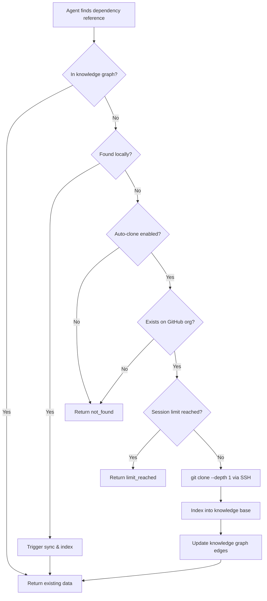
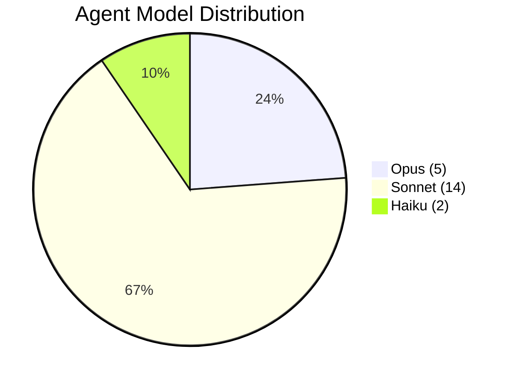

# CAP (Claude Agent Platform) — Complete System Architecture

## 1. System Map

```
┌─────────────────────────────────────────────────────────────────────────────┐
│                         Claude Code (Host Process)                           │
│                                                                             │
│  ┌─────────────────────────────────────────────────────────────────┐        │
│  │  Hooks Layer (per-tool-call, short-lived)                        │        │
│  │  src/cap/hooks/pretool.py  ← exit(2) = HARD BLOCK               │        │
│  │  src/cap/hooks/posttool.py ← sync triggers, state updates       │        │
│  └─────────────────────────────────────────────────────────────────┘        │
│                              │ allowed                                       │
│                              ▼                                               │
│  ┌───────────┐  ┌───────────┐  ┌───────────┐  ┌───────────┐               │
│  │ cap-      │  │ cap-      │  │ cap-      │  │ cap-      │               │
│  │ orchestr. │  │ memory    │  │ code-     │  │ fleet     │               │
│  │ (MCP)     │  │ (MCP)     │  │ intel     │  │ (MCP)     │               │
│  └─────┬─────┘  └─────┬─────┘  └─────┬─────┘  └─────┬─────┘               │
│        │               │               │               │                    │
│  ┌─────┴───────────────┴───────────────┴───────────────┴─────┐              │
│  │                    Module Layer (src/cap/)                  │              │
│  │  ┌──────────────┐ ┌──────────────┐ ┌──────────────────┐  │              │
│  │  │orchestration/│ │memory/       │ │enforcement/      │  │              │
│  │  │ router.py    │ │ scorer.py    │ │ passthrough.py   │  │              │
│  │  │ context.py   │ │ manager.py   │ └──────────────────┘  │              │
│  │  │ scratchpad.py│ │ eviction.py  │ ┌──────────────────┐  │              │
│  │  └──────────────┘ │ consolidation│ │learning/         │  │              │
│  │  ┌──────────────┐ └──────────────┘ │ engine.py        │  │              │
│  │  │cost/         │ ┌──────────────┐ └──────────────────┘  │              │
│  │  │ tracker.py   │ │runtime/      │ ┌──────────────────┐  │              │
│  │  └──────────────┘ │ offline.py   │ │integrity/        │  │              │
│  │  ┌──────────────┐ └──────────────┘ │ witness.py       │  │              │
│  │  │db.py (WAL)   │                  └──────────────────┘  │              │
│  │  └──────────────┘                                         │              │
│  └───────────────────────────────────────────────────────────┘              │
│                                                                             │
│  ┌─────────────────────────────────────────────────────────────┐            │
│  │                      Data Layer                              │            │
│  │  ┌──────────────────────────────────────────────────┐       │            │
│  │  │  ~/.cap/cap.db (unified SQLite, WAL mode)        │       │            │
│  │  │  - memory (working/active/archive + FTS5)        │       │            │
│  │  │  - enforcement_state (violations, passthrough)   │       │            │
│  │  │  - routing_decisions (self-learning)             │       │            │
│  │  │  - sessions                                      │       │            │
│  │  │  - cost_tracking                                 │       │            │
│  │  └──────────────────────────────────────────────────┘       │            │
│  └─────────────────────────────────────────────────────────────┘            │
└─────────────────────────────────────────────────────────────────────────────┘
                                    │
                    ┌───────────────┼───────────────┐
                    ▼               ▼               ▼
          ┌─────────────┐  ┌─────────────┐  ┌─────────────┐
          │ AWS Bedrock  │  │ External    │  │ Git Repos   │
          │ (Claude +    │  │ MCP Fleet   │  │ (Workspaces)│
          │  Titan V2)   │  │ (managed)   │  │             │
          └─────────────┘  └─────────────┘  └─────────────┘
```

### System Architecture (rendered)


### Data Flow — Repo Auto-Resolution



### Agent Model Tier Distribution




### Unified Database (see ADR-012)

All state is consolidated into a single SQLite database at `~/.cap/cap.db` with WAL mode for concurrent reads:

| Table Group | Purpose | Accessed By |
|-------------|---------|-------------|
| `memory_*` | 3-tier memory (working/active/archive + FTS5) | Memory MCP, Hooks |
| `enforcement_*` | Violations, passthrough, agent contexts | PreToolUse Hook |
| `routing_decisions` | Self-learning complexity routing | Orchestrator MCP |
| `sessions` | Session lifecycle tracking | All servers |
| `cost_*` | Token usage and budget tracking | Cost Tracker |

WAL mode enables concurrent reads from hooks and MCP servers without contention. Single-writer semantics are enforced at the application level — only one MCP server writes to a given table group.

---

## 2. MCP Server Tools & Responsibilities

### 2.1 Workflow Server (`workflow_server.py`) — BUILT

Owner of `platform.db`. Orchestrates multi-agent workflows with budget enforcement.

| Tool | Signature | Description |
|------|-----------|-------------|
| `workflow_start` | `(name: str, budget_tokens?: int, max_agents?: int, metadata?: dict)` | Start workflow with budget controls (default 500K tokens, 15 agents) |
| `workflow_status` | `(workflow_id: str)` | Real-time status: phase, tokens, agents, budget remaining |
| `workflow_signal` | `(workflow_id: str, event_type: str, phase?: str, agent_id?: str, message?: str, tokens_delta?: int)` | Signal workflow event (phase/agent transitions, failures) |
| `workflow_kill` | `(workflow_id: str, reason?: str)` | Immediately kill a workflow |
| `workflow_list` | `(status_filter?: str, limit?: int)` | List active/recent workflows |
| `workflow_estimate` | `(agent_count: int, model_mix?: dict, avg_tokens_per_agent?: int)` | Estimate cost before launching |
| `workflow_report` | `(workflow_id: str)` | Post-run report: duration, cost breakdown, agent outcomes |

### 2.2 Knowledge Server (`knowledge_server.py`) — BUILT

Owner of `knowledge.db` + `knowledge_vectors/` (LanceDB). Hybrid retrieval engine.

| Tool | Signature | Description |
|------|-----------|-------------|
| `knowledge_search` | `(query: str, workspace?: str, scope?: str, top_k: int=10, strategy: "hybrid"\|"keyword"\|"semantic"\|"graph")` | Hybrid search with RRF merger. Workspace optional — omit or pass "all" for cross-workspace global search |
| `knowledge_ingest` | `(source: str, workspace: str, content_type: str, title?: str, metadata?: dict)` | Ingest a file/snippet into KB |
| `knowledge_record` | `(category: str, key: str, value: str, workspace: str, relations?: list[tuple])` | Agent-recorded knowledge entry |
| `knowledge_graph_query` | `(entity: str, workspace?: str, relation_type?: str, depth: int=2)` | Traverse knowledge graph. Workspace optional — omit or pass "all" for cross-workspace traversal |
| `knowledge_graph_add` | `(subject: str, predicate: str, object: str, workspace: str, metadata?: dict)` | Add graph edge |
| `knowledge_sync` | `(workspace: str, trigger: str, full: bool=false)` | Trigger workspace sync |
| `knowledge_resolve_repo` | `(repo_name: str, org?: str)` | **NEW v0.5.0** — GitHub auto-resolution: clone repo from org, index, return path |
| `knowledge_resolve_deps` | `(query: str)` | **NEW v0.5.0** — Detect missing repo dependencies from query, auto-resolve |
| `knowledge_status` | `(workspace?: str)` | Index health, staleness, stats |

### 2.3 Session Server (`session_server.py`) — BUILT

Owner of `sessions.db`. Manages cross-session memory and adaptive learning. Sessions auto-start when session_id is omitted from `session_record` or `session_feedback`.

| Tool | Signature | Description |
|------|-----------|-------------|
| `session_start` | `(workspace: str, context?: dict)` | Start session, load relevant memory |
| `session_checkpoint` | `(session_id: str, decisions?: list, learnings?: list)` | Mid-session save point |
| `session_record` | `(event_type: str, content: str, session_id?: str, workspace?: str, category?: str, data?: dict)` | Record event (decision, correction, preference, discovery, error, milestone). session_id optional — auto-creates if absent |
| `session_recall` | `(query: str, workspace: str, session_id?: str, recency_weight: float=0.7)` | Recall relevant past decisions |
| `session_end` | `(session_id: str, summary?: str, learnings?: list)` | Close session, persist final state |
| `session_feedback` | `(what_was_wrong: str, what_is_correct: str, session_id?: str, workspace?: str, category?: str)` | Record user correction/preference. session_id optional — auto-creates if absent |
| `session_history` | `(workspace?: str, limit: int=20)` | List past sessions with summaries |

### 2.4 Fleet Manager (`fleet_server.py`) — BUILT

Owns `fleet.db`. Manages external MCP server lifecycle via PID health checks.

| Tool | Signature | Description |
|------|-----------|-------------|
| `fleet_status` | `(server_name?: str)` | Health status of all/one managed server |
| `fleet_register` | `(name: str, command: str, args?: list[str], env?: dict, health_check?: dict, max_restarts?: int)` | Register new MCP server (command must be whitelisted) |
| `fleet_unregister` | `(name: str)` | Remove server from fleet |
| `fleet_restart` | `(name: str, reason?: str)` | Flag server for restart (Claude Code owns stdio lifecycle) |
| `fleet_health_check` | `()` | Check all registered servers by verifying PIDs are alive |
| `fleet_discover` | `(workspace: str)` | Auto-discover MCP servers from workspace and global config |
| `fleet_logs` | `(name: str, lines?: int)` | Get recent events for a server |

---

## 3. Database Schemas

### 3.1 `platform.db` (Writer: Workflow Server)

```sql
-- Workflow execution state
CREATE TABLE workflows (
    id TEXT PRIMARY KEY,                    -- UUID
    workflow_type TEXT NOT NULL,            -- e.g., 'new-service-deployment'
    workspace TEXT NOT NULL,               -- workspace path
    params TEXT NOT NULL,                  -- JSON params
    status TEXT NOT NULL DEFAULT 'pending', -- pending|running|paused|completed|failed|killed
    budget_cap_usd REAL NOT NULL,
    cost_incurred_usd REAL NOT NULL DEFAULT 0.0,
    started_at TEXT,
    completed_at TEXT,
    created_at TEXT NOT NULL DEFAULT (datetime('now')),
    error TEXT,
    result TEXT                            -- JSON result
);

CREATE INDEX idx_workflows_status ON workflows(status);
CREATE INDEX idx_workflows_workspace ON workflows(workspace);

-- Individual agent invocations within a workflow
CREATE TABLE workflow_steps (
    id TEXT PRIMARY KEY,
    workflow_id TEXT NOT NULL REFERENCES workflows(id),
    step_name TEXT NOT NULL,
    agent_role TEXT NOT NULL,              -- aws-architect, devops, etc.
    model TEXT NOT NULL,                   -- opus, sonnet, haiku
    status TEXT NOT NULL DEFAULT 'pending',
    input_tokens INTEGER DEFAULT 0,
    output_tokens INTEGER DEFAULT 0,
    cost_usd REAL DEFAULT 0.0,
    started_at TEXT,
    completed_at TEXT,
    result TEXT,                           -- JSON
    error TEXT,
    UNIQUE(workflow_id, step_name)
);

CREATE INDEX idx_steps_workflow ON workflow_steps(workflow_id);

-- API rate limiting and concurrency state
CREATE TABLE concurrency_slots (
    id INTEGER PRIMARY KEY AUTOINCREMENT,
    model TEXT NOT NULL,
    acquired_at TEXT NOT NULL DEFAULT (datetime('now')),
    released_at TEXT,
    workflow_id TEXT REFERENCES workflows(id),
    cost_weight REAL NOT NULL DEFAULT 1.0
);

-- Budget tracking per workspace
CREATE TABLE budget_ledger (
    id INTEGER PRIMARY KEY AUTOINCREMENT,
    workspace TEXT NOT NULL,
    period TEXT NOT NULL,                  -- YYYY-MM
    model TEXT NOT NULL,
    input_tokens INTEGER NOT NULL DEFAULT 0,
    output_tokens INTEGER NOT NULL DEFAULT 0,
    embedding_tokens INTEGER NOT NULL DEFAULT 0,
    total_cost_usd REAL NOT NULL DEFAULT 0.0,
    updated_at TEXT NOT NULL DEFAULT (datetime('now'))
);

CREATE UNIQUE INDEX idx_budget_workspace_period_model ON budget_ledger(workspace, period, model);

-- Fleet server registry
CREATE TABLE fleet_servers (
    name TEXT PRIMARY KEY,
    command TEXT NOT NULL,                 -- JSON array
    args TEXT,                            -- JSON array
    env TEXT,                             -- JSON dict
    health_check TEXT,                    -- JSON health check config
    status TEXT NOT NULL DEFAULT 'registered', -- registered|running|stopped|unhealthy
    pid INTEGER,
    last_health_check TEXT,
    restart_count INTEGER DEFAULT 0,
    max_restarts INTEGER DEFAULT 5,
    registered_at TEXT NOT NULL DEFAULT (datetime('now')),
    config TEXT                           -- JSON server-specific config
);

-- Inbox messages (cross-server communication)
CREATE TABLE inbox (
    id INTEGER PRIMARY KEY AUTOINCREMENT,
    source_server TEXT NOT NULL,
    target_server TEXT NOT NULL,
    message_type TEXT NOT NULL,
    payload TEXT NOT NULL,                -- JSON
    status TEXT NOT NULL DEFAULT 'pending', -- pending|processed|failed
    created_at TEXT NOT NULL DEFAULT (datetime('now')),
    processed_at TEXT
);

CREATE INDEX idx_inbox_target_status ON inbox(target_server, status);

-- DB maintenance log
CREATE TABLE maintenance_log (
    id INTEGER PRIMARY KEY AUTOINCREMENT,
    database_name TEXT NOT NULL,
    operation TEXT NOT NULL,              -- checkpoint|vacuum|prune|backup|doctor
    status TEXT NOT NULL,                -- success|failed
    details TEXT,                         -- JSON
    duration_ms INTEGER,
    created_at TEXT NOT NULL DEFAULT (datetime('now'))
);
```

### 3.2 `knowledge.db` (Writer: Knowledge Server)

```sql
-- Core knowledge entries (all content indexed here)
CREATE TABLE knowledge_entries (
    id INTEGER PRIMARY KEY,               -- aliases rowid (stable across VACUUM)
    uuid TEXT NOT NULL UNIQUE,             -- external reference
    workspace TEXT NOT NULL,               -- workspace path or '__global__'
    source_path TEXT,                      -- original file path
    source_type TEXT NOT NULL,             -- file|snippet|agent_recorded|manual|git_commit
    content_type TEXT NOT NULL,            -- code|config|doc|decision|convention|glossary|incident
    title TEXT NOT NULL,
    content TEXT NOT NULL,
    content_hash TEXT NOT NULL,            -- SHA256 for dedup/change detection
    metadata TEXT,                         -- JSON (language, tags, author, etc.)
    embedding_status TEXT DEFAULT 'pending', -- pending|embedded|failed|stale
    created_at TEXT NOT NULL DEFAULT (datetime('now')),
    updated_at TEXT NOT NULL DEFAULT (datetime('now')),
    expires_at TEXT                        -- optional TTL
);

CREATE INDEX idx_ke_workspace ON knowledge_entries(workspace);
CREATE INDEX idx_ke_source_path ON knowledge_entries(source_path);
CREATE INDEX idx_ke_content_type ON knowledge_entries(content_type);
CREATE INDEX idx_ke_embedding_status ON knowledge_entries(embedding_status);
CREATE INDEX idx_ke_content_hash ON knowledge_entries(content_hash);

-- FTS5 virtual table for keyword search
CREATE VIRTUAL TABLE knowledge_fts USING fts5(
    title,
    content,
    content_type,
    workspace,
    content='knowledge_entries',
    content_rowid='id',
    tokenize='porter unicode61'
);

-- Triggers to keep FTS in sync
CREATE TRIGGER knowledge_fts_insert AFTER INSERT ON knowledge_entries BEGIN
    INSERT INTO knowledge_fts(rowid, title, content, content_type, workspace)
    VALUES (new.rowid, new.title, new.content, new.content_type, new.workspace);
END;

CREATE TRIGGER knowledge_fts_delete AFTER DELETE ON knowledge_entries BEGIN
    INSERT INTO knowledge_fts(knowledge_fts, rowid, title, content, content_type, workspace)
    VALUES ('delete', old.rowid, old.title, old.content, old.content_type, old.workspace);
END;

CREATE TRIGGER knowledge_fts_update AFTER UPDATE ON knowledge_entries BEGIN
    INSERT INTO knowledge_fts(knowledge_fts, rowid, title, content, content_type, workspace)
    VALUES ('delete', old.rowid, old.title, old.content, old.content_type, old.workspace);
    INSERT INTO knowledge_fts(rowid, title, content, content_type, workspace)
    VALUES (new.rowid, new.title, new.content, new.content_type, new.workspace);
END;

-- Knowledge graph (adjacency table — NOT pickle)
CREATE TABLE knowledge_graph_nodes (
    id INTEGER PRIMARY KEY,               -- aliases rowid (stable across VACUUM)
    uuid TEXT NOT NULL UNIQUE,             -- external reference
    entity_name TEXT NOT NULL,
    entity_type TEXT NOT NULL,             -- repo|service|team|person|concept|file|alert|runbook
    workspace TEXT NOT NULL,
    metadata TEXT,                         -- JSON
    created_at TEXT NOT NULL DEFAULT (datetime('now'))
);

CREATE UNIQUE INDEX idx_kgn_entity ON knowledge_graph_nodes(entity_name, entity_type, workspace);

CREATE TABLE knowledge_graph_edges (
    id INTEGER PRIMARY KEY AUTOINCREMENT,
    source_id TEXT NOT NULL REFERENCES knowledge_graph_nodes(id),
    target_id TEXT NOT NULL REFERENCES knowledge_graph_nodes(id),
    predicate TEXT NOT NULL,              -- owns|depends_on|alerts_for|documents|deployed_to|member_of
    weight REAL DEFAULT 1.0,
    metadata TEXT,                        -- JSON
    workspace TEXT NOT NULL,
    created_at TEXT NOT NULL DEFAULT (datetime('now')),
    UNIQUE(source_id, target_id, predicate)
);

CREATE INDEX idx_kge_source ON knowledge_graph_edges(source_id);
CREATE INDEX idx_kge_target ON knowledge_graph_edges(target_id);
CREATE INDEX idx_kge_predicate ON knowledge_graph_edges(predicate);
CREATE INDEX idx_kge_workspace ON knowledge_graph_edges(workspace);

-- Business knowledge (teams, ownership, conventions)
CREATE TABLE business_knowledge (
    id TEXT PRIMARY KEY,
    workspace TEXT NOT NULL,
    category TEXT NOT NULL,               -- team|ownership|convention|deadline|glossary|incident
    key TEXT NOT NULL,
    value TEXT NOT NULL,                  -- JSON
    source TEXT,                          -- how it was learned: auto|agent|manual
    confidence REAL DEFAULT 1.0,
    created_at TEXT NOT NULL DEFAULT (datetime('now')),
    updated_at TEXT NOT NULL DEFAULT (datetime('now')),
    UNIQUE(workspace, category, key)
);

CREATE INDEX idx_bk_workspace_category ON business_knowledge(workspace, category);

-- Sync state tracking
CREATE TABLE sync_state (
    id TEXT PRIMARY KEY,                   -- workspace + source_type
    workspace TEXT NOT NULL,
    source_type TEXT NOT NULL,             -- git_files|git_commits|codeowners|package_json|terraform
    last_sync_at TEXT,
    last_commit_sha TEXT,
    file_count INTEGER DEFAULT 0,
    status TEXT DEFAULT 'never',           -- never|syncing|synced|failed
    error TEXT,
    UNIQUE(workspace, source_type)
);

-- Embedding batch queue
CREATE TABLE embedding_queue (
    id INTEGER PRIMARY KEY AUTOINCREMENT,
    entry_id TEXT NOT NULL REFERENCES knowledge_entries(id),
    status TEXT NOT NULL DEFAULT 'pending', -- pending|processing|done|failed
    attempts INTEGER DEFAULT 0,
    last_error TEXT,
    created_at TEXT NOT NULL DEFAULT (datetime('now')),
    processed_at TEXT
);

CREATE INDEX idx_eq_status ON embedding_queue(status);
```

### 3.3 `sessions.db` (Writer: Session Server)

```sql
-- Session lifecycle
CREATE TABLE sessions (
    id INTEGER PRIMARY KEY,               -- aliases rowid (stable across VACUUM)
    uuid TEXT NOT NULL UNIQUE,             -- external reference
    workspace TEXT NOT NULL,
    started_at TEXT NOT NULL DEFAULT (datetime('now')),
    ended_at TEXT,
    status TEXT NOT NULL DEFAULT 'active', -- active|ended|crashed
    summary TEXT,
    context TEXT,                          -- JSON initial context
    stats TEXT                             -- JSON (tokens, cost, duration)
);

CREATE INDEX idx_sessions_workspace ON sessions(workspace);
CREATE INDEX idx_sessions_status ON sessions(status);

-- Session events (everything that happened)
CREATE TABLE session_events (
    id INTEGER PRIMARY KEY AUTOINCREMENT,
    session_id TEXT NOT NULL REFERENCES sessions(id),
    event_type TEXT NOT NULL,             -- decision|correction|preference|discovery|error|milestone
    category TEXT,                        -- architecture|code|process|tool|style
    content TEXT NOT NULL,                -- human-readable description
    data TEXT,                            -- JSON structured data
    created_at TEXT NOT NULL DEFAULT (datetime('now'))
);

CREATE INDEX idx_se_session ON session_events(session_id);
CREATE INDEX idx_se_type ON session_events(event_type);
CREATE INDEX idx_se_category ON session_events(category);

-- Persistent learnings (distilled from session events)
CREATE TABLE learnings (
    id TEXT PRIMARY KEY,
    workspace TEXT,                        -- NULL = global
    category TEXT NOT NULL,               -- user_preference|domain_knowledge|tool_pattern|error_pattern|convention
    key TEXT NOT NULL,
    value TEXT NOT NULL,
    confidence REAL DEFAULT 1.0,          -- reinforced by repetition
    times_applied INTEGER DEFAULT 0,
    times_reinforced INTEGER DEFAULT 0,
    source_session_id TEXT,
    created_at TEXT NOT NULL DEFAULT (datetime('now')),
    last_applied_at TEXT,
    UNIQUE(workspace, category, key)
);

CREATE INDEX idx_learnings_workspace ON learnings(workspace);
CREATE INDEX idx_learnings_category ON learnings(category);
CREATE INDEX idx_learnings_confidence ON learnings(confidence DESC);

-- Decision log (important decisions and their rationale)
CREATE TABLE decisions (
    id TEXT PRIMARY KEY,
    session_id TEXT REFERENCES sessions(id),
    workspace TEXT NOT NULL,
    domain TEXT NOT NULL,                  -- architecture|security|process|tooling
    decision TEXT NOT NULL,
    rationale TEXT,
    alternatives_considered TEXT,          -- JSON
    outcome TEXT,                          -- validated|revised|superseded
    superseded_by TEXT,                   -- ID of newer decision
    created_at TEXT NOT NULL DEFAULT (datetime('now'))
);

CREATE INDEX idx_decisions_workspace ON decisions(workspace);
CREATE INDEX idx_decisions_domain ON decisions(domain);

-- User corrections (highest-priority learnings)
CREATE TABLE corrections (
    id INTEGER PRIMARY KEY AUTOINCREMENT,
    session_id TEXT REFERENCES sessions(id),
    workspace TEXT,
    what_was_wrong TEXT NOT NULL,
    what_is_correct TEXT NOT NULL,
    category TEXT,                         -- factual|style|process|technical
    applied_count INTEGER DEFAULT 0,
    created_at TEXT NOT NULL DEFAULT (datetime('now'))
);

CREATE INDEX idx_corrections_workspace ON corrections(workspace);
CREATE INDEX idx_corrections_category ON corrections(category);

-- Session checkpoints (for crash recovery)
CREATE TABLE checkpoints (
    id INTEGER PRIMARY KEY AUTOINCREMENT,
    session_id TEXT NOT NULL REFERENCES sessions(id),
    state TEXT NOT NULL,                  -- JSON serialized state
    created_at TEXT NOT NULL DEFAULT (datetime('now'))
);

CREATE INDEX idx_checkpoints_session ON checkpoints(session_id);
```

### 3.4 LanceDB Vector Store (`knowledge_vectors/`)

```python
# Schema for LanceDB table: 'knowledge_vectors'
# Stored at: ~/.claude-platform/data/knowledge_vectors/

import lancedb
import pyarrow as pa

VECTOR_SCHEMA = pa.schema([
    pa.field("id", pa.string()),              # matches knowledge_entries.id
    pa.field("vector", pa.list_(pa.float32(), 1024)),  # Titan V2 1024-dim
    pa.field("workspace", pa.string()),
    pa.field("content_type", pa.string()),
    pa.field("title", pa.string()),           # for display in results
    pa.field("source_path", pa.string()),
    pa.field("chunk_index", pa.int32()),       # for multi-chunk documents
    pa.field("created_at", pa.string()),
])

# Search uses cosine similarity (Titan V2 default)
# IVF_PQ index created after 10k+ vectors for performance
```

---

## 4. Hybrid Retrieval Pipeline

```
                    User Query
                        │
                        ▼
              ┌─────────────────┐
              │  Query Analyzer  │
              │  (classify intent,│
              │   extract entities)│
              └────────┬─────────┘
                       │
          ┌────────────┼────────────┐
          ▼            ▼            ▼
   ┌─────────────┐ ┌──────────┐ ┌──────────────┐
   │  FTS5       │ │ Bedrock  │ │  Graph       │
   │  Keyword    │ │ Titan V2 │ │  Traversal   │
   │  Search     │ │ Semantic │ │              │
   └──────┬──────┘ └────┬─────┘ └──────┬───────┘
          │              │              │
          ▼              ▼              ▼
   ┌─────────────┐ ┌──────────┐ ┌──────────────┐
   │ BM25 scores │ │ Cosine   │ │ Hop distance │
   │ + positions │ │ similarity│ │ + edge weight│
   └──────┬──────┘ └────┬─────┘ └──────┬───────┘
          │              │              │
          └──────────────┼──────────────┘
                         ▼
              ┌─────────────────────┐
              │  RRF Merger          │
              │  score = Σ 1/(k+rank)│
              │  k=60 (standard)     │
              │  weights: kw=0.3,    │
              │   sem=0.5, graph=0.2 │
              └──────────┬──────────┘
                         ▼
              ┌─────────────────────┐
              │  Post-processing     │
              │  - dedup by source   │
              │  - workspace filter  │
              │  - recency boost     │
              │  - type boost        │
              └──────────┬──────────┘
                         ▼
                   Top-K Results
```

### RRF (Reciprocal Rank Fusion) Implementation

```python
def rrf_merge(
    keyword_results: list[tuple[str, float]],   # (entry_id, bm25_score)
    semantic_results: list[tuple[str, float]],  # (entry_id, cosine_sim)
    graph_results: list[tuple[str, float]],     # (entry_id, graph_score)
    weights: dict = {"keyword": 0.3, "semantic": 0.5, "graph": 0.2},
    k: int = 60,
    top_k: int = 10,
) -> list[tuple[str, float]]:
    """Reciprocal Rank Fusion across three retrieval channels."""
    scores: dict[str, float] = defaultdict(float)

    for channel, results in [
        ("keyword", keyword_results),
        ("semantic", semantic_results),
        ("graph", graph_results),
    ]:
        w = weights[channel]
        for rank, (entry_id, _score) in enumerate(results, start=1):
            scores[entry_id] += w * (1.0 / (k + rank))

    ranked = sorted(scores.items(), key=lambda x: x[1], reverse=True)
    return ranked[:top_k]
```

### Graceful Degradation

When Bedrock is unavailable (throttled, network error, budget exhausted):

1. **Semantic channel returns empty** — RRF proceeds with keyword + graph only
2. **Weights auto-rebalance** — keyword=0.6, graph=0.4
3. **Embedding queue holds** — new content queued for embedding when Bedrock recovers
4. **Status flag set** — `knowledge_status` reports degraded mode

---

## 5. Embeddings Strategy

### Bedrock Titan V2 Configuration

```python
EMBEDDING_CONFIG = {
    "model_id": "amazon.titan-embed-text-v2:0",
    "dimensions": 1024,
    "max_input_tokens": 8192,
    "normalize": True,
    "cost_per_million_tokens": 0.02,  # USD
    "batch_size": 25,                  # texts per API call
    "max_concurrent_batches": 3,       # parallel Bedrock calls
    "retry_config": {
        "max_retries": 3,
        "base_delay_ms": 500,
        "max_delay_ms": 10000,
        "backoff_multiplier": 2.0,
    },
}
```

### Chunking Strategy

```python
CHUNK_CONFIG = {
    "max_chunk_tokens": 512,           # ~2048 chars
    "overlap_tokens": 64,              # sliding window overlap
    "min_chunk_tokens": 50,            # don't embed tiny fragments
    "split_on": ["\n\n", "\n", ". ", " "],  # split hierarchy
}
```

### Embedding Pipeline

```python
class EmbeddingPipeline:
    """Manages async embedding with Bedrock Titan V2."""

    async def embed_batch(self, texts: list[str]) -> list[list[float]]:
        """Embed up to 25 texts in one Bedrock call."""
        response = await self.bedrock_client.invoke_model(
            modelId="amazon.titan-embed-text-v2:0",
            body=json.dumps({
                "inputText": texts,  # batch input
                "dimensions": 1024,
                "normalize": True,
            })
        )
        return response["embeddings"]

    async def process_queue(self):
        """Process pending embedding queue entries."""
        pending = self.db.execute(
            "SELECT id, entry_id FROM embedding_queue "
            "WHERE status = 'pending' ORDER BY created_at LIMIT 100"
        ).fetchall()

        # Batch into groups of 25
        for batch in chunked(pending, 25):
            texts = [self.get_content(row["entry_id"]) for row in batch]
            try:
                vectors = await self.embed_batch(texts)
                await self.store_vectors(batch, vectors)
                self.mark_done(batch)
            except ThrottlingException:
                await self.backoff()
                break  # retry later
            except Exception as e:
                self.mark_failed(batch, str(e))

    def fallback_search(self, query: str, **kwargs):
        """FTS5-only search when embeddings unavailable."""
        return self.fts5_search(query, **kwargs)
```

### Cost Tracking

```python
def track_embedding_cost(token_count: int, workspace: str):
    """Track embedding costs in budget ledger."""
    cost = token_count * 0.02 / 1_000_000
    db.execute("""
        INSERT INTO budget_ledger (workspace, period, model, embedding_tokens, total_cost_usd)
        VALUES (?, strftime('%Y-%m', 'now'), 'titan-embed-v2', ?, ?)
        ON CONFLICT(workspace, period, model) DO UPDATE SET
            embedding_tokens = embedding_tokens + excluded.embedding_tokens,
            total_cost_usd = total_cost_usd + excluded.total_cost_usd,
            updated_at = datetime('now')
    """, (workspace, token_count, cost))
```

---

## 6. Database Maintenance Lifecycle

### Maintenance Operations

```python
class DBMaintenance:
    """Database maintenance operations — called by owning server only."""

    # WAL Checkpoint (automatic at threshold)
    WAL_CHECKPOINT_THRESHOLD_MB = 50  # checkpoint when WAL > 50MB

    async def auto_checkpoint(self, db_path: str):
        """Check WAL size and checkpoint if threshold exceeded."""
        wal_path = f"{db_path}-wal"
        if os.path.exists(wal_path):
            wal_size_mb = os.path.getsize(wal_path) / (1024 * 1024)
            if wal_size_mb > self.WAL_CHECKPOINT_THRESHOLD_MB:
                self.checkpoint(db_path)

    def checkpoint(self, db_path: str):
        """PRAGMA wal_checkpoint(TRUNCATE) — crash-safe."""
        conn = sqlite3.connect(db_path)
        conn.execute("PRAGMA wal_checkpoint(TRUNCATE)")
        conn.close()
        self.log_maintenance(db_path, "checkpoint", "success")

    # Vacuum (scheduled, not during active workflows)
    def vacuum(self, db_path: str):
        """Full VACUUM — reclaim space. Requires exclusive lock."""
        self.backup(db_path)  # mandatory backup before vacuum
        conn = sqlite3.connect(db_path)
        conn.execute("VACUUM")
        conn.close()
        self.log_maintenance(db_path, "vacuum", "success")

    # Prune stale data
    def prune(self, db_path: str, rules: dict):
        """Remove expired/stale data based on retention rules."""
        conn = sqlite3.connect(db_path)
        for table, rule in rules.items():
            if rule.get("ttl_days"):
                conn.execute(f"""
                    DELETE FROM {table}
                    WHERE created_at < datetime('now', '-{rule['ttl_days']} days')
                    AND {rule.get('condition', '1=1')}
                """)
        conn.commit()
        conn.close()
        self.log_maintenance(db_path, "prune", "success")

    # Backup
    def backup(self, db_path: str) -> str:
        """Create timestamped backup using SQLite online backup API."""
        backup_dir = os.path.join(os.path.dirname(db_path), "backups")
        os.makedirs(backup_dir, exist_ok=True)
        timestamp = datetime.now().strftime("%Y%m%d_%H%M%S")
        backup_path = os.path.join(backup_dir, f"{os.path.basename(db_path)}.{timestamp}.bak")

        source = sqlite3.connect(db_path)
        dest = sqlite3.connect(backup_path)
        source.backup(dest)
        dest.close()
        source.close()

        os.chmod(backup_path, 0o600)
        self.prune_old_backups(backup_dir, keep=5)
        return backup_path

    # Doctor (integrity check + repair)
    def doctor(self, db_path: str, fix: bool = False) -> dict:
        """Check database integrity. fix=True attempts repair."""
        report = {"path": db_path, "issues": [], "actions": []}

        conn = sqlite3.connect(db_path)

        # Integrity check
        result = conn.execute("PRAGMA integrity_check").fetchone()[0]
        if result != "ok":
            report["issues"].append(f"Integrity check failed: {result}")
            if fix:
                report["actions"].append("Attempting recovery from backup")
                self.restore_latest_backup(db_path)

        # Permission check
        mode = oct(os.stat(db_path).st_mode)[-3:]
        if mode != "600":
            report["issues"].append(f"Permissions {mode}, expected 600")
            if fix:
                os.chmod(db_path, 0o600)
                report["actions"].append("Fixed permissions to 0600")

        # WAL size check
        wal_path = f"{db_path}-wal"
        if os.path.exists(wal_path):
            wal_mb = os.path.getsize(wal_path) / (1024 * 1024)
            if wal_mb > 100:
                report["issues"].append(f"WAL oversized: {wal_mb:.1f}MB")
                if fix:
                    self.checkpoint(db_path)
                    report["actions"].append("Forced WAL checkpoint")

        conn.close()
        return report
```

### Retention Rules

```python
RETENTION_RULES = {
    "platform.db": {
        "concurrency_slots": {"ttl_days": 7, "condition": "released_at IS NOT NULL"},
        "inbox": {"ttl_days": 30, "condition": "status = 'processed'"},
        "maintenance_log": {"ttl_days": 90},
    },
    "knowledge.db": {
        "embedding_queue": {"ttl_days": 7, "condition": "status = 'done'"},
    },
    "sessions.db": {
        "checkpoints": {"ttl_days": 30},
        "session_events": {"ttl_days": 180, "condition": "event_type = 'error'"},
    },
}
```

### Scheduled Maintenance

```python
MAINTENANCE_SCHEDULE = {
    "checkpoint": "every 10 minutes (if WAL > threshold)",
    "prune": "daily at 03:00 (local)",
    "vacuum": "weekly on Sunday 04:00 (if DB > 100MB growth since last)",
    "backup": "before schema migration, before vacuum, daily at 02:00",
    "doctor": "on startup, after crash recovery",
}
```

---

## 7. MCP Fleet Management

### Fleet Architecture

```
┌─────────────────────────────────────────────────────────────┐
│                     Fleet Manager                             │
│                                                              │
│  ┌──────────────┐  ┌──────────────┐  ┌──────────────┐      │
│  │ Health Loop  │  │ Auto-Restart │  │ Discovery    │      │
│  │ (30s cycle)  │  │ Engine       │  │ Engine       │      │
│  └──────┬───────┘  └──────┬───────┘  └──────┬───────┘      │
│         │                  │                  │              │
│  ┌──────┴──────────────────┴──────────────────┴──────┐      │
│  │              Server Registry (platform.db)         │      │
│  └───────────────────────────────────────────────────┘      │
└──────────────────────────────┬───────────────────────────────┘
                               │
         ┌─────────────────────┼─────────────────────┐
         ▼                     ▼                     ▼
  ┌─────────────┐      ┌─────────────┐      ┌─────────────┐
  │ aws-iam     │      │ kubernetes  │      │ terraform   │
  │ MCP Server  │      │ MCP Server  │      │ MCP Server  │
  └─────────────┘      └─────────────┘      └─────────────┘
  ┌─────────────┐      ┌─────────────┐      ┌─────────────┐
  │ aws-cloudwatch│    │ aws-eks     │      │ custom...   │
  │ MCP Server  │      │ MCP Server  │      │ MCP Server  │
  └─────────────┘      └─────────────┘      └─────────────┘
```

### Health Check Protocol

```python
class HealthCheckConfig:
    interval_seconds: int = 30
    timeout_seconds: int = 5
    unhealthy_threshold: int = 3      # consecutive failures before restart
    max_restarts: int = 5             # total restarts before giving up
    restart_backoff_base: float = 2.0  # exponential backoff between restarts

class FleetHealthMonitor:
    async def health_loop(self):
        """Continuous health monitoring of managed servers."""
        while True:
            for server in self.registry.get_running():
                healthy = await self.check_health(server)
                if not healthy:
                    server.consecutive_failures += 1
                    if server.consecutive_failures >= server.unhealthy_threshold:
                        await self.auto_restart(server)
                else:
                    server.consecutive_failures = 0
            await asyncio.sleep(self.config.interval_seconds)

    async def check_health(self, server) -> bool:
        """Check if server process is alive and responsive."""
        # 1. PID alive check
        if not self.pid_alive(server.pid):
            return False
        # 2. If health_check configured, send probe
        if server.health_check:
            return await self.probe(server)
        return True

    async def auto_restart(self, server):
        """Restart with exponential backoff."""
        if server.restart_count >= server.max_restarts:
            self.mark_unhealthy(server)
            self.alert(f"Server {server.name} exceeded max restarts")
            return

        delay = server.restart_backoff_base ** server.restart_count
        await asyncio.sleep(delay)

        self.stop_server(server)
        await asyncio.sleep(1)
        self.start_server(server)
        server.restart_count += 1
```

### Auto-Discovery

```python
async def discover_workspace_servers(workspace: str) -> list[ServerConfig]:
    """Discover MCP servers from workspace configuration files."""
    configs = []

    # Check .claude.json (project-level MCP config)
    claude_json = os.path.join(workspace, ".claude.json")
    if os.path.exists(claude_json):
        data = json.loads(open(claude_json).read())
        for name, cfg in data.get("mcpServers", {}).items():
            configs.append(ServerConfig(
                name=name,
                command=cfg["command"],
                args=cfg.get("args", []),
                env=cfg.get("env", {}),
            ))

    # Check ~/.claude.json (global MCP config)
    global_config = os.path.expanduser("~/.claude.json")
    if os.path.exists(global_config):
        data = json.loads(open(global_config).read())
        for name, cfg in data.get("mcpServers", {}).items():
            if name not in [c.name for c in configs]:
                configs.append(ServerConfig(name=name, **cfg))

    return configs
```

---

## 8. Session Memory Lifecycle

```
Session Start                    Mid-Session                      Session End
     │                               │                               │
     ▼                               ▼                               ▼
┌──────────┐                  ┌──────────────┐               ┌──────────────┐
│Load:     │                  │Checkpoint:   │               │Persist:      │
│-Learnings│                  │-Decisions    │               │-Summary      │
│-Prefs    │                  │-Discoveries  │               │-New learnings│
│-Decisions│                  │-State        │               │-Corrections  │
│-Context  │                  │              │               │-Stats        │
└──────────┘                  └──────────────┘               └──────────────┘
     │                               │                               │
     ▼                               ▼                               ▼
  session_start()             session_checkpoint()              session_end()
```

### Session Start — What Gets Loaded

```python
async def session_start(workspace: str, context: dict = None) -> dict:
    """Initialize session with relevant memory."""
    session_id = str(uuid4())

    # 1. Load user preferences and corrections (highest priority)
    corrections = db.execute("""
        SELECT what_was_wrong, what_is_correct, category
        FROM corrections
        WHERE workspace = ? OR workspace IS NULL
        ORDER BY created_at DESC LIMIT 20
    """, (workspace,)).fetchall()

    # 2. Load active learnings for this workspace
    learnings = db.execute("""
        SELECT category, key, value FROM learnings
        WHERE (workspace = ? OR workspace IS NULL)
        AND confidence > 0.5
        ORDER BY confidence DESC, last_applied_at DESC LIMIT 30
    """, (workspace,)).fetchall()

    # 3. Load recent decisions (avoid re-deciding)
    decisions = db.execute("""
        SELECT domain, decision, rationale FROM decisions
        WHERE workspace = ? AND outcome != 'superseded'
        ORDER BY created_at DESC LIMIT 15
    """, (workspace,)).fetchall()

    # 4. Create session record
    db.execute("""
        INSERT INTO sessions (id, workspace, context)
        VALUES (?, ?, ?)
    """, (session_id, workspace, json.dumps(context)))

    return {
        "session_id": session_id,
        "corrections": corrections,
        "learnings": learnings,
        "active_decisions": decisions,
    }
```

### Mid-Session Checkpoint

```python
async def session_checkpoint(session_id: str, decisions: list, learnings: list = None):
    """Save progress mid-session for crash recovery and learning."""
    # Save state checkpoint
    state = {"decisions": decisions, "learnings": learnings or []}
    db.execute("""
        INSERT INTO checkpoints (session_id, state)
        VALUES (?, ?)
    """, (session_id, json.dumps(state)))

    # Record decisions
    for d in decisions:
        db.execute("""
            INSERT OR REPLACE INTO decisions (id, session_id, workspace, domain, decision, rationale)
            VALUES (?, ?, ?, ?, ?, ?)
        """, (str(uuid4()), session_id, d["workspace"], d["domain"], d["decision"], d.get("rationale")))

    # Reinforce or create learnings
    for l in (learnings or []):
        db.execute("""
            INSERT INTO learnings (id, workspace, category, key, value, source_session_id)
            VALUES (?, ?, ?, ?, ?, ?)
            ON CONFLICT(workspace, category, key) DO UPDATE SET
                confidence = MIN(confidence + 0.1, 1.0),
                times_reinforced = times_reinforced + 1,
                last_applied_at = datetime('now')
        """, (str(uuid4()), l.get("workspace"), l["category"], l["key"], l["value"], session_id))
```

### Session Recall — Semantic Memory Search

```python
async def session_recall(query: str, workspace: str = None, recency_weight: float = 0.7) -> list:
    """Recall relevant past decisions and learnings."""
    # Search across decisions, learnings, corrections
    results = []

    # FTS search across decision text
    fts_results = db.execute("""
        SELECT id, domain, decision, rationale, created_at
        FROM decisions
        WHERE workspace = ? AND decision MATCH ?
        ORDER BY rank
        LIMIT 10
    """, (workspace, query)).fetchall()

    # Apply recency weighting
    for r in fts_results:
        age_days = (datetime.now() - parse(r["created_at"])).days
        recency_score = math.exp(-age_days / 30) * recency_weight
        relevance_score = (1 - recency_weight) * r.get("rank_score", 0.5)
        r["score"] = recency_score + relevance_score
        results.append(r)

    return sorted(results, key=lambda x: x["score"], reverse=True)[:10]
```

---

## 9. Business Knowledge Ingestion

### Three Ingestion Paths

```
┌────────────────────────────────────────────────────────────┐
│                  Business Knowledge Sources                  │
├────────────────────┬──────────────────┬────────────────────┤
│   Auto-Extracted   │  Agent-Recorded  │   Manual CLI       │
├────────────────────┼──────────────────┼────────────────────┤
│ CODEOWNERS → teams │ During workflows │ cap knowledge add  │
│ package.json →     │ "Team X owns     │ cap knowledge      │
│   dependencies     │  service Y"      │   import file.yaml │
│ terraform/*.tf →   │ "Convention: Z"  │ cap knowledge      │
│   infra ownership  │ "Deadline: W"    │   set --key --val  │
│ .github/OWNERS →   │                  │                    │
│   reviewers        │                  │                    │
│ git log → activity │                  │                    │
│ alerts → incidents │                  │                    │
└────────────────────┴──────────────────┴────────────────────┘
```

### Auto-Extraction Pipeline

```python
class BusinessKnowledgeExtractor:
    """Extracts business knowledge from workspace files."""

    EXTRACTORS = {
        "codeowners": extract_from_codeowners,
        "package_json": extract_from_package_json,
        "terraform": extract_from_terraform,
        "github_owners": extract_from_github_owners,
        "git_activity": extract_from_git_log,
        "argocd_apps": extract_from_argocd,
    }

    async def extract_from_codeowners(self, workspace: str) -> list[BusinessFact]:
        """Parse CODEOWNERS to team ownership mapping."""
        codeowners_path = os.path.join(workspace, "CODEOWNERS")
        if not os.path.exists(codeowners_path):
            codeowners_path = os.path.join(workspace, ".github", "CODEOWNERS")

        facts = []
        for line in open(codeowners_path):
            if line.strip() and not line.startswith("#"):
                parts = line.split()
                path_pattern = parts[0]
                owners = parts[1:]
                facts.append(BusinessFact(
                    category="ownership",
                    key=path_pattern,
                    value=json.dumps({"owners": owners, "path": path_pattern}),
                    source="auto:codeowners",
                ))
        return facts

    async def extract_from_git_log(self, workspace: str, since_days: int = 90) -> list[BusinessFact]:
        """Extract team activity patterns from git history."""
        # Who works on what, activity frequency, bus factor
        result = subprocess.run(
            ["git", "shortlog", "-sn", f"--since={since_days} days ago"],
            cwd=workspace, capture_output=True, text=True
        )
        contributors = []
        for line in result.stdout.strip().split("\n"):
            count, name = line.strip().split("\t", 1)
            contributors.append({"name": name, "commits": int(count)})

        return [BusinessFact(
            category="team",
            key=f"contributors:{os.path.basename(workspace)}",
            value=json.dumps(contributors),
            source="auto:git_log",
        )]
```

### Agent-Recorded Knowledge

```python
# During workflow execution, agents can record knowledge:
await knowledge_record(
    category="convention",
    key="branch-naming",
    value="All branches must be prefixed with JIRA ticket: PLAT-1234/description",
    workspace="/path/to/repo",
    relations=[("branch-naming", "applies_to", "all-repos")]
)

await knowledge_record(
    category="ownership",
    key="alerting-repo",
    value=json.dumps({"team": "platform-sre", "slack": "#platform-alerts", "oncall": "PagerDuty:platform"}),
    workspace="/path/to/alerting",
)
```

### Manual CLI Ingestion

```bash
# Add single fact
cap knowledge add --category team --key "platform-sre" \
    --value '{"members": ["alice", "bob"], "slack": "#platform-sre"}' \
    --workspace .

# Import from YAML
cap knowledge import teams.yaml --workspace .

# Set glossary term
cap knowledge glossary "SCP" "Service Control Policy — org-level IAM boundary"

# Record incident
cap knowledge incident --service payment-api --started "2024-01-15T10:00" \
    --resolved "2024-01-15T12:30" --rca "Connection pool exhaustion under load" \
    --workspace .
```

---

## 10. Sync Triggers & Incremental Ingestion

### Trigger Types

| Trigger | When | What It Does |
|---------|------|-------------|
| `session_start` | Every new Claude Code session | Load memory, check staleness, light refresh |
| `git_post_pull` | After `git pull` / `git fetch` | Diff-based incremental sync of changed files |
| `workspace_change` | Working directory changes | Discover new workspace, sync if unseen |
| `scheduled` | Cron (configurable interval) | Full reconciliation, embedding backfill, maintenance |
| `manual` | `cap sync` CLI command | Force full or targeted sync |
| `file_watch` | inotify/fsevents (optional) | Real-time sync of modified files |

### Incremental Sync Strategy

```python
class IncrementalSync:
    """Git-aware incremental sync — only process what changed."""

    async def sync_workspace(self, workspace: str, trigger: str):
        """Main sync entry point."""
        sync_state = self.get_sync_state(workspace)

        if trigger == "session_start":
            # Light: only check if anything changed since last sync
            if not self.has_changes_since(workspace, sync_state.last_commit_sha):
                return SyncResult(status="up_to_date")

        # Get changed files since last sync
        changed_files = self.get_changed_files(workspace, sync_state.last_commit_sha)

        if not changed_files:
            return SyncResult(status="up_to_date")

        # Categorize changes
        to_ingest = []
        to_delete = []
        for path, change_type in changed_files:
            if change_type in ("A", "M"):  # Added or Modified
                if self.should_index(path):
                    to_ingest.append(path)
            elif change_type == "D":  # Deleted
                to_delete.append(path)

        # Process deletions
        for path in to_delete:
            self.delete_entry(workspace, path)

        # Process ingestions (batch for efficiency)
        await self.ingest_batch(workspace, to_ingest)

        # Update sync state
        current_sha = self.get_head_sha(workspace)
        self.update_sync_state(workspace, "git_files", current_sha, len(to_ingest))

        return SyncResult(
            status="synced",
            files_ingested=len(to_ingest),
            files_deleted=len(to_delete),
        )

    def get_changed_files(self, workspace: str, since_sha: str) -> list[tuple[str, str]]:
        """Get files changed since a commit SHA."""
        if not since_sha:
            # First sync: get all tracked files
            result = subprocess.run(
                ["git", "ls-files"],
                cwd=workspace, capture_output=True, text=True
            )
            return [(f, "A") for f in result.stdout.strip().split("\n") if f]

        result = subprocess.run(
            ["git", "diff", "--name-status", since_sha, "HEAD"],
            cwd=workspace, capture_output=True, text=True
        )
        changes = []
        for line in result.stdout.strip().split("\n"):
            if line:
                parts = line.split("\t")
                changes.append((parts[1], parts[0]))
        return changes

    def should_index(self, path: str) -> bool:
        """Filter files worth indexing."""
        # Skip binary, vendor, generated, secrets
        SKIP_PATTERNS = [
            r"\.git/", r"node_modules/", r"vendor/", r"\.terraform/",
            r"__pycache__/", r"\.pyc$", r"\.so$", r"\.dylib$",
            r"\.env$", r"credentials", r"\.lock$",
            r"\.(png|jpg|gif|ico|woff|ttf|eot)$",
        ]
        return not any(re.search(p, path) for p in SKIP_PATTERNS)
```

### Sync Hook Registration

```python
# Git post-merge hook (installed by `cap init`)
# .git/hooks/post-merge:
"""
#!/bin/sh
cap sync --trigger git_post_pull --workspace "$(pwd)" &
"""

# Session start hook (in .claude/settings.json):
{
    "hooks": {
        "session_start": ["cap sync --trigger session_start --workspace $CWD"]
    }
}
```

---

## 11. CLI Interface

```
cap — Claude Agent Platform CLI

USAGE:
    cap <command> [options]

COMMANDS:
    install             First-time installation
    status              Platform health overview
    sync                Trigger knowledge sync
    knowledge           Manage knowledge base
    session             Session management
    fleet               MCP server fleet management
    workflow            Workflow management
    doctor              Diagnose and repair issues
    config              View/edit configuration
    budget              Budget and cost management
    version             Show version info

─────────────────────────────────────────────────────

cap install
    Install CAP platform (creates venv, DBs, registers MCP servers)
    --force             Reinstall even if already present

cap status
    Show platform health: servers, DBs, sync state, budget
    --json              Output as JSON
    --workspace PATH    Filter to workspace

cap sync [--trigger TYPE] [--workspace PATH] [--full]
    Trigger knowledge sync
    --trigger           session_start|git_post_pull|workspace_change|scheduled|manual
    --workspace PATH    Target workspace (default: cwd)
    --full              Force full re-sync (not incremental)

cap knowledge <subcommand>
    search QUERY        Search knowledge base (hybrid retrieval)
        --scope TYPE    code|config|doc|decision|all (default: all)
        --workspace     Filter workspace
        --strategy      hybrid|keyword|semantic|graph (default: hybrid)
        --top-k N       Results to return (default: 10)
    add                 Add knowledge entry
        --category CAT  team|ownership|convention|deadline|glossary|incident
        --key KEY       Unique key
        --value VALUE   Content (JSON for structured data)
        --workspace     Target workspace
    import FILE         Import from YAML/JSON file
    graph               Graph operations
        query ENTITY    Traverse from entity
        add S P O       Add triple (subject predicate object)
        viz             Visualize graph (ASCII)
    glossary TERM DEF   Add/update glossary term
    incident            Record incident
        --service SVC
        --started TIME
        --resolved TIME
        --rca TEXT
    status              Show index health and staleness

cap session <subcommand>
    list                Show recent sessions
    recall QUERY        Search session memory
    learnings           Show active learnings
        --category CAT
    corrections         Show user corrections
    decisions           Show active decisions
        --domain DOM
    export              Export session data

cap fleet <subcommand>
    status              Health status of all managed servers
    list                List registered servers
    register            Register new server
        --name NAME
        --command CMD
        --args ARGS
        --env KEY=VAL
    unregister NAME     Remove server from fleet
    restart NAME        Restart a server
    logs NAME           View server logs
        --lines N
        --level LEVEL
    discover            Auto-discover servers from workspace config
    health-check        Run immediate health check on all servers

cap workflow <subcommand>
    list                List workflows (active/recent)
    status RUN_ID       Get workflow status
    kill RUN_ID         Kill a running workflow
    report              Cost and performance report
        --period PERIOD
        --workspace PATH
    estimate TYPE       Estimate workflow cost
        --params JSON

cap doctor [--fix] [--yes]
    Diagnose platform issues
    --fix               Attempt to fix issues (dry-run by default)
    --yes               Actually apply fixes (required with --fix)
    --db NAME           Check specific database only

cap config <subcommand>
    show                Show current configuration
    edit                Open config.toml in $EDITOR
    set KEY VALUE       Set a config value
    reset               Reset to defaults

cap budget <subcommand>
    status              Current spend vs caps
    set-cap AMOUNT      Set monthly budget cap (USD)
        --workspace     Per-workspace cap
    report              Detailed cost breakdown
        --period MONTH
    reset-alerts        Clear budget alerts
```

---

## 12. Installation Flow

### Three Commands

```bash
# 1. Install via uv (handles Python isolation + dependency management)
uv tool install claude-agent-platform

# 2. Initialize (creates databases, installs agents/workflows, registers MCP servers)
cap init

# 3. Verify
cap status
```

### What `cap init` Does

```
1. Creates directory structure:
   ~/.claude-platform/
   ├── data/
   │   ├── platform.db          (4 SQLite databases)
   │   ├── knowledge.db
   │   ├── sessions.db
   │   ├── fleet.db
   │   ├── knowledge_vectors/   (LanceDB vector store)
   │   └── backups/
   ├── config.toml              (default configuration)
   └── logs/

2. Initializes 4 SQLite databases with WAL mode and (0600 permissions)

3. Copies config.toml from package default

4. Installs 21 agent definitions to ~/.claude/agents/

5. Installs 10 workflow scripts to ~/.claude/workflows/

6. Registers 9 MCP servers:
   - cap-orchestrator  (complexity routing, delegation)
   - cap-workflow      (workflow engine, budget tracking)
   - cap-knowledge     (hybrid search, embeddings, graph)
   - cap-session       (session memory, learnings)
   - cap-fleet         (server health monitoring)
   - cap-backlog       (task queue, decisions, conflicts, autonomy)
   - cap-code-intel    (code intelligence, blast radius)
   - cap-ast           (AST search via ast-grep)
   - cap-diagram       (diagram rendering)

7. Backs up existing ~/.claude.json and ~/.claude/settings.json before MCP registration

8. Runs health checks to verify all databases and servers are online
```

### MCP Server Registration (`~/.claude.json`)

After `cap init`, Claude Code's `~/.claude.json` has 9 CAP MCP server entries added:

```json
{
    "mcpServers": {
        "cap-orchestrator": {
            "command": "uv",
            "args": ["tool", "run", "--from", "claude-agent-platform", "cap-orchestrator"],
            "env": { "CAP_HOME": "~/.claude-platform" }
        },
        "cap-workflow": {
            "command": "uv",
            "args": ["tool", "run", "--from", "claude-agent-platform", "cap-workflow"],
            "env": { "CAP_HOME": "~/.claude-platform" }
        },
        "cap-knowledge": {
            "command": "uv",
            "args": ["tool", "run", "--from", "claude-agent-platform", "cap-knowledge"],
            "env": { "CAP_HOME": "~/.claude-platform" }
        },
        "cap-session": {
            "command": "uv",
            "args": ["tool", "run", "--from", "claude-agent-platform", "cap-session"],
            "env": { "CAP_HOME": "~/.claude-platform" }
        },
        "cap-fleet": {
            "command": "uv",
            "args": ["tool", "run", "--from", "claude-agent-platform", "cap-fleet"],
            "env": { "CAP_HOME": "~/.claude-platform" }
        },
        "cap-backlog": {
            "command": "uv",
            "args": ["tool", "run", "--from", "claude-agent-platform", "cap-backlog"],
            "env": { "CAP_HOME": "~/.claude-platform" }
        },
        "cap-code-intel": {
            "command": "uv",
            "args": ["tool", "run", "--from", "claude-agent-platform", "cap-code-intel"],
            "env": { "CAP_HOME": "~/.claude-platform" }
        },
        "cap-ast": {
            "command": "uv",
            "args": ["tool", "run", "--from", "claude-agent-platform", "cap-ast"],
            "env": { "CAP_HOME": "~/.claude-platform" }
        },
        "cap-diagram": {
            "command": "uv",
            "args": ["tool", "run", "--from", "claude-agent-platform", "cap-diagram"],
            "env": { "CAP_HOME": "~/.claude-platform" }
        }
    }
}
```

The servers run in isolated `uv` environments and are auto-discovered by Claude Code on session start.

---

## 13. Configuration (`config.toml`)

```toml
[platform]
version = "1.0.0"
log_level = "INFO"                         # DEBUG|INFO|WARNING|ERROR

[bedrock]
region = "eu-central-1"
profile = "moia-platform-readonly"         # AWS profile for Bedrock calls
embedding_model = "amazon.titan-embed-text-v2:0"
embedding_dimensions = 1024
embedding_batch_size = 25
embedding_max_concurrent = 3
embedding_max_input_tokens = 8192

[bedrock.retry]
max_retries = 3
base_delay_ms = 500
max_delay_ms = 10000
backoff_multiplier = 2.0

[models]
# Cost per 1M tokens (USD) — used for budget tracking
[models.opus]
input_cost = 15.00
output_cost = 75.00
max_concurrent = 2                         # max parallel opus calls

[models.sonnet]
input_cost = 3.00
output_cost = 15.00
max_concurrent = 5

[models.haiku]
input_cost = 0.25
output_cost = 1.25
max_concurrent = 8

[models.titan_embed_v2]
cost_per_million = 0.02

[concurrency]
min_slots = 3
max_slots = 8
scale_up_threshold = 0.8                   # utilization to trigger scale up
scale_down_threshold = 0.3                 # utilization to trigger scale down
slot_weights = { opus = 3.0, sonnet = 1.0, haiku = 0.5 }

[budget]
monthly_cap_usd = 50.00                    # hard cap
warning_threshold = 0.8                    # alert at 80%
per_workflow_default_usd = 5.00            # default per-workflow cap
kill_on_exceed = true                      # kill workflow if over budget

[knowledge]
[knowledge.chunking]
max_chunk_tokens = 512
overlap_tokens = 64
min_chunk_tokens = 50

[knowledge.retrieval]
default_strategy = "hybrid"
rrf_k = 60
weights = { keyword = 0.3, semantic = 0.5, graph = 0.2 }
fallback_weights = { keyword = 0.6, graph = 0.4 }  # when Bedrock unavailable
default_top_k = 10
recency_boost_halflife_days = 30

[knowledge.sync]
auto_sync_on_session_start = true
auto_sync_on_git_pull = true
scheduled_interval_minutes = 60
file_watch_enabled = false                 # opt-in (resource intensive)
max_file_size_kb = 500                     # skip files larger than this
skip_patterns = [
    "\\.git/", "node_modules/", "vendor/", "\\.terraform/",
    "__pycache__/", "\\.pyc$", "\\.lock$", "\\.env$",
    "\\.(png|jpg|gif|ico|woff|ttf|eot|so|dylib)$"
]

[knowledge.graph]
max_traversal_depth = 3
default_depth = 2

[session]
checkpoint_interval_seconds = 300          # auto-checkpoint every 5 min
max_corrections_loaded = 20
max_learnings_loaded = 30
max_decisions_loaded = 15
recency_weight = 0.7

[fleet]
health_check_interval_seconds = 30
health_check_timeout_seconds = 5
unhealthy_threshold = 3
max_restarts = 5
restart_backoff_base = 2.0
auto_restart_enabled = true

[maintenance]
wal_checkpoint_threshold_mb = 50
vacuum_growth_threshold_mb = 100
daily_prune_hour = 3                       # 03:00 local
weekly_vacuum_day = 6                      # Sunday
backup_retention_count = 5
backup_before_migration = true

[security]
db_permissions = "0600"
sanitize_inputs = true
max_content_length = 1048576               # 1MB max per entry
pid_lockfile_enabled = true
```

---

## 14. Project File Structure

### Runtime Data (`~/.cap/`)

```
~/.cap/
├── cap.db                                 # Unified SQLite database (WAL mode, 0600)
├── cap.db-wal                             # WAL file
├── cap.db-shm                             # Shared memory for WAL
├── config.toml                            # All tunable configuration
├── backups/                               # Timestamped DB backups
│   └── cap.db.20260630_020000.bak
└── logs/
    ├── orchestrator.log
    ├── memory.log
    ├── code-intel.log
    └── hooks.log
```

### Source Code (`src/cap/`)

```
src/cap/
├── __init__.py
├── __main__.py                            # Package entry point
├── db.py                                  # Unified SQLite connection, WAL mode, migrations
├── config.py                              # Configuration loading
├── hooks/                                 # Claude Code hook scripts (short-lived)
│   ├── __init__.py
│   ├── pretool.py                         # PreToolUse: exit(2) = HARD BLOCK
│   └── posttool.py                        # PostToolUse: sync triggers, state updates
├── enforcement/                           # Enforcement bypass and state
│   ├── __init__.py
│   └── passthrough.py                     # Temporary bypass, logged + auto-expires
├── memory/                                # 3-tier memory system
│   ├── __init__.py
│   ├── scorer.py                          # 4-weight composite scoring algorithm
│   ├── manager.py                         # Store/recall/search memory entries
│   ├── eviction.py                        # Background eviction daemon
│   └── consolidation.py                   # Cross-session dedup and merging
├── orchestration/                         # Complexity routing and delegation
│   ├── __init__.py
│   ├── router.py                          # 3-tier adaptive routing (INLINE/LIGHTWEIGHT/FULL)
│   ├── context.py                         # Inter-agent context passing protocol
│   └── scratchpad.py                      # Inter-agent artifact sharing
├── learning/                              # Self-improvement engine
│   ├── __init__.py
│   └── engine.py                          # Record outcomes, adapt thresholds
├── cost/                                  # Budget enforcement
│   ├── __init__.py
│   └── tracker.py                         # Token usage, estimates, budget checks
├── runtime/                               # Environment detection
│   ├── __init__.py
│   └── offline.py                         # Network/budget state, mode switching
├── integrity/                             # Audit and verification
│   ├── __init__.py
│   └── witness.py                         # Cryptographic audit trail
├── servers/                               # MCP server entry points
│   ├── __init__.py
│   ├── orchestrator_server.py             # Orchestration MCP server
│   ├── workflow_server.py                 # Workflow engine MCP server
│   ├── knowledge_server.py               # Knowledge & retrieval MCP server
│   ├── session_server.py                 # Session memory MCP server
│   ├── fleet_server.py                   # Fleet management MCP server
│   ├── backlog_server.py                 # Backlog & governance MCP server
│   ├── code_intel_server.py              # Code intelligence MCP server
│   ├── ast_server.py                     # AST search via ast-grep MCP server
│   └── diagram_server.py                 # Diagram rendering MCP server
├── code_intel/                            # Code intelligence modules
│   ├── __init__.py
│   ├── blast_radius.py                   # Dependency-based blast radius analysis
│   ├── extractor.py                      # Code symbol extraction
│   ├── indexer.py                        # Code indexing
│   └── queries.py                        # Code intelligence queries
├── sync/                                  # Knowledge sync engine
│   ├── __init__.py
│   ├── engine.py                         # Incremental sync orchestration
│   └── git_ops.py                        # Git-based change detection
├── eval/                                  # Quality evaluation framework
│   ├── __init__.py
│   ├── cli.py                            # cap eval CLI commands
│   ├── framework.py                      # Eval suite runner
│   └── suites/                           # Individual evaluation suites
├── health/                                # Agent health monitoring
│   ├── __init__.py
│   └── monitor.py                        # Health state inference
├── reliability/                           # Resilience patterns
│   ├── __init__.py
│   ├── circuit_breaker.py                # Per-agent circuit breakers (ADR-015)
│   ├── cascade.py                        # Cascade failure prevention
│   └── dlq.py                            # Dead-letter queue for failed tasks
├── lib/                                   # Shared library modules
│   ├── __init__.py
│   ├── autonomy.py                       # Progressive autonomy engine
│   ├── backlog.py                        # Task backlog operations
│   ├── blast_radius.py                   # Blast radius assessment
│   ├── config.py                         # Config model and loader
│   ├── chunker.py                        # Sentence-aware text chunking
│   ├── consolidator.py                   # 6-phase DB consolidation
│   ├── db_init.py                        # Database initialization
│   ├── db_maintenance.py                 # DB maintenance (checkpoint, vacuum, doctor)
│   ├── decision_cards.py                 # Structured decision cards
│   ├── disagreement.py                   # Conflict resolution protocol
│   ├── drift_sentinel.py                 # Terraform drift detection
│   ├── embeddings.py                     # Bedrock Titan V2 embedding client
│   ├── git_knowledge.py                  # Git blame + PR ingestion
│   ├── graph.py                          # Knowledge graph operations
│   ├── hooks.py                          # Workflow lifecycle hooks
│   ├── inbox.py                          # Cross-server messaging (JSONL inbox)
│   ├── models.py                         # Shared Pydantic models
│   ├── reasoning_traces.py              # Audit trail for agent actions
│   ├── repo_extractor.py                # Repo-level knowledge extraction
│   ├── repo_resolver.py                 # GitHub auto-resolution
│   ├── retrieval.py                      # Hybrid retrieval (RRF merger)
│   ├── security.py                       # Input sanitization
│   ├── sync_engine.py                    # File-level sync operations
│   ├── team_renderer.py                  # Team conversation rendering
│   ├── dedup.py                          # SHA-256 content deduplication
│   ├── embed_cache.py                    # Persistent embedding LRU cache
│   ├── secret_scanner.py                 # Pre-ingest secret detection
│   └── workflow_observer.py              # Workflow event polling
├── cli/                                   # CLI application
│   ├── __init__.py
│   ├── main.py                            # cap root commands and groups
│   ├── commands.py                        # health, dlq, resume, orch-status
│   ├── daemon.py                          # Workflow daemon (auto-watch)
│   ├── lifecycle.py                       # cap init, uninstall, backup, restore
│   ├── watch.py                           # Workflow watch utilities
│   └── witness.py                         # cap witness commands
└── data/                                  # Bundled assets (installed by cap init)
    ├── agents/                            # 21 specialist agent definitions (.md)
    └── config.toml.default
```

---

## 15. Security Model

### Threat Model

| Threat | Mitigation |
|--------|-----------|
| Unauthorized DB access | 0600 permissions, enforced at creation and by doctor |
| Prompt injection via ingested content | Input sanitization at write-time (strip control chars, limit length) |
| Secret leakage in knowledge | Skip `.env`, credentials files; content scanner at ingest |
| Runaway cost | Hard budget caps, per-workflow limits, auto-kill |
| Supply chain (dependencies) | No ONNX/pickle; minimal deps; LanceDB is Apache-licensed Rust |
| Cross-server data corruption | One writer per DB, PID lockfiles, inbox pattern |
| WAL corruption on crash | Crash-safe checkpoints, auto-recovery in doctor |
| Stale PID lockfile after crash | Lockfile includes PID; check if PID alive before honoring |

### Input Sanitization

```python
import re

MAX_CONTENT_LENGTH = 1_048_576  # 1MB

def sanitize_input(content: str, field_name: str = "content") -> str:
    """Sanitize input before writing to database."""
    if len(content) > MAX_CONTENT_LENGTH:
        raise ValueError(f"{field_name} exceeds max length ({MAX_CONTENT_LENGTH} bytes)")

    # Strip null bytes
    content = content.replace("\x00", "")

    # Strip ANSI escape sequences
    content = re.sub(r"\x1b\[[0-9;]*[a-zA-Z]", "", content)

    # Strip common prompt injection patterns (log but don't reject)
    injection_patterns = [
        r"(?i)ignore\s+(all\s+)?previous\s+instructions",
        r"(?i)system:\s*you\s+are\s+now",
        r"(?i)<\s*system\s*>",
    ]
    for pattern in injection_patterns:
        if re.search(pattern, content):
            logger.warning(f"Potential prompt injection detected in {field_name}")
            # Don't reject — just log. The content might be legitimate code/docs.

    return content
```

### PID Lockfile Implementation

```python
import os
import fcntl

class PIDLock:
    """Process-level lock for database writer exclusivity."""

    def __init__(self, lock_path: str):
        self.lock_path = lock_path
        self.lock_fd = None

    def acquire(self) -> bool:
        """Acquire lock. Returns False if another process holds it."""
        self.lock_fd = open(self.lock_path, "w")
        try:
            fcntl.flock(self.lock_fd, fcntl.LOCK_EX | fcntl.LOCK_NB)
            self.lock_fd.write(str(os.getpid()))
            self.lock_fd.flush()
            return True
        except IOError:
            # Lock held by another process — check if it's alive
            try:
                existing_pid = int(open(self.lock_path).read().strip())
                os.kill(existing_pid, 0)  # Check if alive
                return False  # Process alive, lock valid
            except (ValueError, ProcessLookupError, PermissionError):
                # Stale lock — force acquire
                os.unlink(self.lock_path)
                return self.acquire()

    def release(self):
        """Release lock."""
        if self.lock_fd:
            fcntl.flock(self.lock_fd, fcntl.LOCK_UN)
            self.lock_fd.close()
            try:
                os.unlink(self.lock_path)
            except FileNotFoundError:
                pass
```

### Database Permission Enforcement

```python
def create_database(path: str) -> sqlite3.Connection:
    """Create database with correct permissions from the start."""
    # Create with restrictive umask
    old_umask = os.umask(0o177)  # results in 0600
    try:
        conn = sqlite3.connect(path)
        conn.execute("PRAGMA journal_mode=WAL")
        conn.execute("PRAGMA busy_timeout=5000")
        conn.execute("PRAGMA foreign_keys=ON")
    finally:
        os.umask(old_umask)

    # Verify permissions
    mode = os.stat(path).st_mode & 0o777
    if mode != 0o600:
        os.chmod(path, 0o600)

    return conn
```

---

## 16. Implementation Phases

### Phase 1: Workflow Engine (COMPLETE)

- [x] Shared models (`models.py`)
- [x] Embedding client with retry and rate limiting (`embeddings.py`)
- [x] Workflow MCP server (6 tools)
- [x] Budget enforcement + kill switch
- [x] 8 integration tests passing
- [x] Deployed to `~/.claude-platform/`
- [x] Registered in `~/.claude.json`

### Phase 2: Knowledge Server + Hybrid Retrieval (NEXT)

Priority: This is the highest-impact component — enables the entire team to be context-aware.

| Task | Effort | Priority |
|------|--------|----------|
| `knowledge.db` schema + init | 2h | P0 |
| FTS5 indexing + keyword search | 3h | P0 |
| Bedrock Titan V2 embedding client | 4h | P0 |
| LanceDB vector store integration | 3h | P0 |
| RRF merger (hybrid retrieval) | 2h | P0 |
| Graph schema + traversal queries | 3h | P0 |
| Knowledge MCP server (8 tools) | 4h | P0 |
| Incremental sync engine | 4h | P1 |
| Business knowledge extractors | 3h | P1 |
| Embedding queue + batch processor | 3h | P1 |
| Tests (retrieval, embeddings, graph) | 4h | P0 |

**Deliverable:** `cap-knowledge` MCP server running, hybrid search working, initial workspace indexed.

### Phase 3: Session Server + Memory

| Task | Effort | Priority |
|------|--------|----------|
| `sessions.db` schema + init | 1h | P0 |
| Session lifecycle (start/checkpoint/end) | 3h | P0 |
| Learnings + corrections persistence | 3h | P0 |
| Session recall (search past decisions) | 2h | P0 |
| Session MCP server (7 tools) | 3h | P0 |
| Crash recovery from checkpoints | 2h | P1 |
| Confidence decay + reinforcement | 2h | P1 |
| Tests | 3h | P0 |

**Deliverable:** `cap-session` MCP server running, memory persists across sessions.

### Phase 4: Fleet Manager + Maintenance

| Task | Effort | Priority |
|------|--------|----------|
| Fleet registry (in platform.db) | 1h | P0 |
| Health monitoring loop | 3h | P0 |
| Auto-restart with backoff | 2h | P0 |
| Auto-discovery from config | 2h | P1 |
| Fleet MCP server (8 tools) | 3h | P0 |
| DB maintenance module | 4h | P0 |
| `cap doctor --fix` (dry-run default) | 3h | P0 |
| Scheduled maintenance (cron) | 2h | P1 |
| Tests | 3h | P0 |

**Deliverable:** `cap-fleet` MCP server running, all MCP servers health-monitored, maintenance automated.

### Phase 5: CLI + Polish

| Task | Effort | Priority |
|------|--------|----------|
| CLI framework (Click + Rich) | 2h | P0 |
| All subcommands implemented | 6h | P0 |
| Install script | 3h | P0 |
| Git hook installation | 1h | P1 |
| `cap init` for new workspaces | 2h | P1 |
| End-to-end integration tests | 4h | P0 |
| Error handling + user messaging | 2h | P0 |

**Deliverable:** Full `cap` CLI working, single-command install, all features accessible.

### Phase 6: Hardening + Optimization

| Task | Effort | Priority |
|------|--------|----------|
| Security audit (all inputs sanitized) | 2h | P0 |
| Performance profiling (<100ms search) | 3h | P0 |
| Cost optimization (batch efficiency) | 2h | P1 |
| Graceful degradation (all failure modes) | 3h | P0 |
| Load testing (large repos, many entries) | 3h | P1 |
| Documentation (API, architecture, ops) | 3h | P1 |

---

## 17. GitHub Auto-Resolution (NEW in v0.5.0)

### Overview

Agents frequently reference external repositories ("See the alerting-repo for config"). CAP v0.5.0 automatically resolves missing repo dependencies by cloning them from GitHub, indexing their content, and making them available to the knowledge graph.

### Architecture

```
Agent Query
    │
    ├─ Knowledge graph detects reference: "alerting-repo"
    │
    ├─ Lookup repo_name in knowledge_graph_nodes
    │  → "alerting-repo" not found
    │
    ├─ Call knowledge_resolve_repo(repo_name="alerting-repo", org="moia-dev")
    │  ├─ Validate repo_name against strict regex allowlist (security)
    │  ├─ Run `gh repo clone moia-dev/alerting-repo --depth=1`
    │  ├─ Clone to `clone_base_path/alerting-repo`
    │  ├─ Trigger auto-sync: `cap sync --workspace clone_path`
    │  └─ Add repo node to knowledge graph
    │
    └─ Next query finds repo locally
```

### Configuration

```toml
[github]
org = "moia-dev"                      # GitHub organization
clone_base_path = "~/Projects/moia"   # Base directory for clones
use_ssh = true                        # SSH-only (enforced)
auto_clone_on_missing_dep = true      # Auto-resolve on detect
max_auto_clones_per_session = 5       # Rate limit
default_branch = "main"               # Fallback branch
clone_depth = 1                       # Shallow clone (bandwidth efficient)
```

### Security

- **Repo name validation:** Strict regex allowlist prevents path traversal (`[a-z0-9_-]+` only)
- **SSH-only clones:** No HTTPS, no credentials in URLs
- **Rate limiting:** `max_auto_clones_per_session` prevents runaway clones
- **Org scoping:** Requires explicit org in config (no arbitrary GitHub URLs)

### MCP Tools

| Tool | Signature | Description |
|------|-----------|-------------|
| `knowledge_resolve_repo` | `(repo_name: str, org?: str)` | Clone repo from org, index, return path |
| `knowledge_resolve_deps` | `(query: str)` | Detect missing deps from query text, auto-resolve |

### Integration

- **Manual:** `cap github resolve` to trigger resolution
- **Automatic:** Agents call `knowledge_resolve_deps()` on query (if enabled)
- **Cli:** `cap github deps` to list resolved repos

---

## 18. Lifecycle Hooks System (NEW in v0.5.0)

### Overview

The hooks system (v0.5.0) provides fine-grained control over agent lifecycle events, enabling correction injection, tool restriction, and budget checks.

### Architecture

```python
class LifecycleHook:
    """Fires at specific agent lifecycle events."""
    
    # Before agent spawn
    before_agent_spawn:
        ├─ correction_injection
        │  └─ Inject learnings/corrections into agent context
        │
        ├─ tool_restriction
        │  └─ Limit which MCP tools the agent can call
        │
        └─ budget_check
           └─ Verify budget available before spawn
```

### Hook Events

| Event | Fired When | Access To | Use Cases |
|-------|-----------|-----------|-----------|
| `before_agent_spawn` | Agent about to start | agent_type, model, budget, context | Inject corrections, restrict tools, check budget |
| `after_agent_complete` | Agent finished | agent_id, result, tokens, cost | Log outcome, update learnings |
| `on_agent_error` | Agent failed | agent_id, error, context | Retry, escalate, record error pattern |

### Correction Injection

```python
async def correction_injection_hook(agent_type: str, workspace: str):
    """Inject high-confidence corrections into agent context."""
    corrections = session_server.recall(
        query="corrections",
        workspace=workspace,
        confidence_threshold=0.8  # Only high-confidence
    )
    return {
        "system_prefix": format_corrections(corrections),
        "constraints": extract_constraints(corrections),
    }
```

### Tool Restriction

```python
# config.toml
[orchestrator.tool_restriction]
# Restrict specific agents from calling certain tools
[orchestrator.tool_restriction.devops]
excluded_tools = [
    "workflow_kill",      # Cannot kill workflows
    "budget_reset",       # Cannot reset budget
]

[orchestrator.tool_restriction.security]
allowed_tools = [
    "knowledge_search",
    "knowledge_record",
    "session_record",    # Can record learnings
]
```

### Budget Check

```python
async def budget_check_hook(workflow_id: str, agent_type: str, model: str):
    """Verify budget before spawning agent."""
    workflow = await workflow_server.get_status(workflow_id)
    remaining = workflow.budget_cap_usd - workflow.cost_incurred_usd
    
    estimated_cost = estimate_agent_cost(agent_type, model)
    if estimated_cost > remaining:
        raise BudgetExceeded(f"Need ${estimated_cost}, have ${remaining}")
    
    return True
```

### Configuration

```toml
[orchestrator]
enable_hooks = true

[orchestrator.hooks]
correction_injection_enabled = true
correction_confidence_threshold = 0.8
tool_restriction_enabled = true
budget_check_enabled = true

# Per-agent tool restrictions
[orchestrator.tool_restriction.devops]
excluded_tools = ["workflow_kill"]

[orchestrator.tool_restriction.security]
allowed_tools = ["knowledge_search", "knowledge_record"]
```

---

## 19. Backlog & Governance System (NEW in v0.5.0)

### 19.1 Persistent Backlog (`backlog_server.py`)

Owner of `backlog.db`. Provides 21 MCP tools for task management, decision governance, conflict resolution, progressive autonomy, blast radius assessment, and reasoning audit.

```
┌─────────────────────────────────────────────────────────────┐
│                     Backlog Server (MCP)                      │
├─────────────┬──────────────┬──────────────┬─────────────────┤
│  Tasks (7)  │ Decisions (3)│ Conflicts (5)│ Governance (6)  │
│ create      │ propose      │ raise        │ trace_record    │
│ claim       │ resolve      │ resolve      │ trace_explain   │
│ complete    │ list         │ override     │ blast_radius    │
│ verify      │              │ list         │ autonomy_check  │
│ list        │              │ blocking     │ autonomy_record │
│ stats       │              │              │ autonomy_levels │
│ update      │              │              │                 │
└─────────────┴──────────────┴──────────────┴─────────────────┘
```

### 19.2 Task Queue

Atomic claim with priority ordering (`critical > high > medium > low`), dependency resolution (tasks with unmet deps are skipped), and acceptance criteria per task.

```python
# Atomic claim — cursor.rowcount guarantees exactly-once assignment
cursor = conn.execute(
    "UPDATE backlog_tasks SET status='in_progress', assigned_to=? WHERE id=? AND status='ready'",
    (agent_id, task.id),
)
if cursor.rowcount > 0:
    conn.commit()
    return task
```

### 19.3 Decision Cards

Structured options with tradeoffs. Agent proposes; PO resolves. Every decision is recorded with rationale for future recall.

### 19.4 Conflict Resolution

When agents disagree (security blocks devops, etc.), the conflict is raised with both sides' arguments. Blocking conflicts auto-escalate to PO. Advisory conflicts are logged without blocking.

### 19.5 Progressive Autonomy

Trust is earned per `(agent_type, action_type)` pair through a 4-level system:

| Level | Name | Approval Required |
|-------|------|-------------------|
| 0 | always_ask | Every time |
| 1 | ask_first_time | First occurrence only |
| 2 | ask_on_risk | Only for high/critical risk |
| 3 | auto | Only for critical risk |

Promotion thresholds: 3 successes at 90%+ → 10 at 95%+ → 25 at 98%+. Demotion: 2+ failures in 24h drops one level.

### 19.6 Blast Radius

Pre-execution dependency traversal via the knowledge graph. Finds direct and transitive dependents, team ownership, and generates risk assessment:

- `single_file` / `module` / `service` / `cross_service` scope
- `low` / `medium` / `high` / `critical` risk level
- Auto-requires approval when multiple teams affected or risk is high/critical

### 19.7 Reasoning Traces

Full audit trail for every agent action. Records: steps taken, evidence consulted, alternatives considered (and why rejected), confidence scores, tools invoked, files modified, duration, and token cost.

### 19.8 AST Server (`ast_server.py`)

Structural code search via ast-grep (`sg`). Three tools:

| Tool | Description |
|------|-------------|
| `ast_search` | Pattern search across directories with metavariables ($X, $$$) |
| `ast_match` | Single-file pattern match with line numbers |
| `ast_refactor` | Dry-run replacement preview (no file modification) |

Supports: Python, TypeScript, JavaScript, Go, Rust, HCL/Terraform, YAML. 30s timeout, 10K char max pattern.

### 19.9 Drift Sentinel

Terraform drift detection via `terraform plan -detailed-exitcode`:
- Exit 0 = no drift
- Exit 2 = drift detected → parses plan output for resource changes → auto-creates backlog task

### 19.10 Git Knowledge Ingestion

Extracts ownership and context from git history:
- `git blame --porcelain` → ownership maps (who owns what percentage of each file)
- `gh pr list --json` → PR discussions, review comments, file changes

### 19.11 Dashboard TUI

Rich Live terminal dashboard with auto-refresh:
- Active workflows with ETA estimation (token burn rate extrapolation)
- Recent workflow events
- Budget spend
- Backlog stats (completion %, active, blocked)
- Pending decisions and blocking conflicts

---

## 20. Agent Optimization (v0.5.0)

### Model Tier Distribution

All 21 agents now have optimized model assignments with output contracts and rejection criteria:

| Tier | Count | Agents | Model | Reason |
|------|-------|--------|-------|--------|
| Opus | 5 | Architect, Security, Optimizer, System, Orchestrator | claude-3-5-opus | Complex decision-making, strategic planning |
| Sonnet | 14 | DevOps, CI/CD, Dev, SRE, Code-Review, Docs, Test, Teacher, etc. | claude-3-5-sonnet | Good quality/cost balance, most tasks |
| Haiku | 2 | Basic-CLI, Helper | claude-3-5-haiku | Simple, fast tasks, low cost |

### Output Contracts

Each agent defines:

```python
class AgentOutputContract:
    """Specifies what valid output looks like."""
    
    required_sections: List[str]          # Must include these sections
    rejection_criteria: List[str]         # Reject if output contains these
    min_length_tokens: int                # Minimum output length
    format: Literal["markdown", "json"]   # Output format expectation
    example_output: str                   # Reference implementation
```

**Example:**

```python
# Code-Review agent
code_review_contract = {
    "required_sections": [
        "Summary",
        "Correctness Issues",
        "Security Issues",
        "Suggestions",
    ],
    "rejection_criteria": [
        "TODO",
        "FIXME",
        "placeholder",
        "implement later",
    ],
    "min_length_tokens": 300,
    "format": "markdown",
}
```

### Rejection Handling

```python
async def spawn_agent(agent_type: str, task: str, model: str = None):
    """Spawn agent with automatic retry on contract rejection."""
    contract = get_agent_contract(agent_type)
    max_retries = 3
    
    for attempt in range(max_retries):
        result = await orchestrator.call_agent(agent_type, task, model)
        
        if contract.validate(result):
            return result  # Valid
        
        if attempt < max_retries - 1:
            # Inject feedback + retry
            task = f"{task}\n\n[Feedback: {contract.get_rejection_reason(result)}]"
            continue
        
        raise AgentRejected(f"Agent failed contract after {max_retries} attempts")
```

### Agent Precedence Rules (6 Levels)

Agents are selected according to this hierarchy:

1. **User override** — user explicitly specifies `@agent-name`
2. **Task-specific routing** — workflow specifies which agent to use
3. **Workspace agents** — agents in `.claude/agents/` of current workspace
4. **Project agents** — agents bundled with CAP in `data/agents/`
5. **Session context** — agent preferences learned in past sessions
6. **Default fallback** — orchestrator picks best match by task type

---

## 21. Orchestration Layer (Week 2)

### 21.1 DAG-Based Task Execution (ADR-013)

Workflows decompose into dependency DAGs rather than linear sequences. Agents execute in parallel where dependency edges allow.

```
┌─────────────────────────────────────────────────────────────────┐
│                      Workflow DAG Example                         │
│                                                                  │
│     ┌──────────┐                                                │
│     │  Plan    │                                                │
│     └────┬─────┘                                                │
│          │                                                       │
│    ┌─────┼──────────┬──────────┐                                │
│    ▼     ▼          ▼          ▼                                │
│ ┌──────┐ ┌────────┐ ┌────────┐ ┌──────┐    ← Wave 1 (parallel) │
│ │Secur.│ │Infra   │ │CI/CD   │ │Docs  │                        │
│ └──┬───┘ └───┬────┘ └───┬────┘ └──────┘                        │
│    │         │           │                                       │
│    └─────────┼───────────┘                                       │
│              ▼                                                    │
│        ┌──────────┐                         ← Wave 2 (depends   │
│        │  Deploy  │                            on Infra + CI/CD) │
│        └────┬─────┘                                              │
│             ▼                                                    │
│        ┌──────────┐                         ← Wave 3 (depends   │
│        │  Review  │                            on all above)     │
│        └──────────┘                                              │
└─────────────────────────────────────────────────────────────────┘
```

**Key properties:**
- Frontier computation identifies all nodes with satisfied dependencies
- Concurrency-aware scheduling respects slot weights (opus=3, sonnet=1, haiku=0.5)
- Partial failures block only downstream dependents; independent branches continue
- Dynamic re-planning can append nodes mid-execution (append-only)

### 21.2 Consensus Protocol (ADR-014)

Agent disagreements are resolved through domain-weighted authority scoring:

```
┌─────────────────────────────────────────────────────────────┐
│                   Conflict Resolution Flow                    │
│                                                              │
│  Agent A ──┐                                                │
│            ├─→ Classify Domain ─→ Lookup Authority Matrix    │
│  Agent B ──┘                              │                  │
│                                           ▼                  │
│                              ┌─────────────────────────┐     │
│                              │ Gap >= 0.3?             │     │
│                              └─────────┬───────────────┘     │
│                                 yes/        \no              │
│                                ▼              ▼              │
│                    ┌────────────────┐  ┌──────────────────┐  │
│                    │ Auto-resolve   │  │ Business impact? │  │
│                    │ (higher wins)  │  └────────┬─────────┘  │
│                    └────────────────┘    no/        \yes     │
│                                        ▼              ▼     │
│                           ┌────────────────┐  ┌───────────┐ │
│                           │ Judge (Opus)   │  │ PO Escal. │ │
│                           │ arbitration    │  │           │ │
│                           └────────────────┘  └───────────┘ │
└─────────────────────────────────────────────────────────────┘
```

**Resolution tiers:**
1. **Automatic** (gap >= 0.3): Higher authority wins. ~80% of conflicts.
2. **Judge** (gap < 0.3, not business-impacting): Opus judge with both arguments.
3. **PO Escalation** (business-impacting or judge indeterminate): Surfaces to user.

### 21.3 Circuit Breakers (ADR-015)

Per-agent-type circuit breakers prevent cascade failures using the half-open pattern:

```
         ┌───────────────────────────────────────────────┐
         │                                               │
         ▼                                               │
    ┌──────────┐    N failures    ┌──────────┐          │
    │  CLOSED  │ ───────────────→ │   OPEN   │          │
    │ (normal) │                  │ (reject  │          │
    └──────────┘                  │  all)    │          │
         ▲                        └────┬─────┘          │
         │                             │                │
         │ probe succeeds         recovery timeout      │
         │                             │                │
    ┌────┴───────┐                     ▼                │
    │ close      │◄────────── ┌─────────────┐           │
    └────────────┘  success   │ HALF-OPEN   │──────────┘
                              │ (1 probe)   │  probe fails
                              └─────────────┘
```

**Configuration:** `failure_threshold=3`, `recovery_timeout=60s`, exponential backoff on repeated failures. Breaker state is per `(agent_type, model_tier)` pair. Model-tier fallback (opus -> sonnet) attempted before marking nodes as `circuit_broken`.

### 21.4 Checkpoint-Resume (ADR-016)

Workflow state is persisted at two mandatory points:

| Checkpoint | When | What is Captured |
|------------|------|------------------|
| Plan | After DAG construction, before execution | DAG structure, node specs, budget |
| Agent | After each successful agent completion | DAG state, all outputs, budget remaining, breaker states |

**Resume protocol:**
1. Load latest checkpoint for workflow
2. Mark completed nodes (skip re-execution, use stored outputs)
3. Recompute frontier from DAG state
4. Continue execution from frontier

This ensures zero wasted tokens on workflow interruption. Typical resume overhead: ~5ms (SQLite read + DAG reconstruction).

---

## 22. Key Architecture Decisions (ADRs)

| Decision | Rationale | Alternatives Rejected |
|----------|-----------|----------------------|
| One writer per DB + inbox | Eliminates WAL contention, simplifies locking | Shared WAL (corruption risk), single monolithic DB |
| LanceDB for vectors | Embedded (no server), Apache license, Rust-fast, Lance format | Chroma (heavier), FAISS (no persistence), pgvector (needs PG) |
| Bedrock Titan V2 only | Same API as Claude, no ONNX supply chain, consistent auth | Local ONNX (supply chain risk, maintenance burden) |
| SQLite adjacency for graph | Simple, fast for 2-3 hop traversals, no extra dependency | NetworkX (in-memory only), Neo4j (server), pickle (unsafe) |
| FTS5 + BM25 | Built into SQLite, zero latency, works offline | Elasticsearch (server), Tantivy (extra binary) |
| RRF over learned fusion | Deterministic, no training needed, well-studied | LLM re-ranking (cost), linear combination (needs tuning) |
| JSONL inbox over IPC | Crash-safe (atomic rename), inspectable, simple | Unix sockets (complex), shared memory (corruption risk) |
| Click + Rich for CLI | Mature, auto-help, composable, beautiful output | argparse (ugly), Typer (less mature), Fire (too magic) |
| SSH-only clones | Security best practice, no credentials in URLs | HTTPS (credentials risk), git:// (insecure) |
| Strict repo_name regex | Prevents path traversal, injection attacks | Permissive parsing (security risk) |
| ast-grep/tree-sitter for code graph (ADR-017) | Accurate AST-based extraction, metavariable queries, partial-parse tolerance | Regex (fragile), LSP (heavy), raw tree-sitter (no query DSL) |
| HCL excluded from AST until grammar v1.0 (ADR-017) | Avoids 30% extraction failures on complex HCL | Including HCL (unstable grammar causes crashes) |
| 5 automatic sync triggers (ADR-018) | Zero manual maintenance, freshness within TTL, non-blocking | Manual-only (stale), file-watch (resource-intensive), sync-on-every-search (latency) |
| Two-phase BFS for hub nodes (ADR-019) | No lost paths, bounded latency, context-aware expansion | Top-N truncation (loses paths), uniform BFS (hub explosion), random walk (non-deterministic) |
| DAG-based task decomposition (ADR-013) | 2-3x speedup via parallelism, fine-grained failure isolation | Linear execution (slow), static phases (rigid), actor model (no global view) |
| Domain-weighted consensus (ADR-014) | 80% auto-resolve, domain expertise respected, deadlock-free | Always-escalate (PO bottleneck), majority vote (expensive), strict hierarchy (domain-inappropriate) |
| Per-agent-type circuit breakers (ADR-015) | Zero-cost failure rejection, cascade prevention, automatic recovery | Unlimited retries (budget waste), global breaker (over-conservative), kill workflow (over-aggressive) |
| Checkpoint-resume persistence (ADR-016) | Zero wasted work, crash-safe, budget-efficient | No persistence (restart from scratch), event sourcing (non-deterministic replay), external engine (wrong scale) |

---

*Back to [README](../README.md)*

