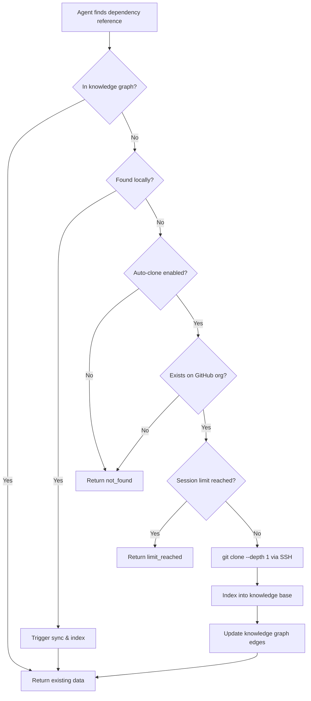

```mermaid
flowchart TD
    A[Agent finds dependency reference] --> B{In knowledge graph?}
    B -->|Yes| C[Return existing data]
    B -->|No| D{Found locally?}
    D -->|Yes| E[Trigger sync & index]
    D -->|No| F{Auto-clone enabled?}
    F -->|No| G[Return not_found]
    F -->|Yes| H{Exists on GitHub org?}
    H -->|No| G
    H -->|Yes| I{Session limit reached?}
    I -->|Yes| J[Return limit_reached]
    I -->|No| K[git clone --depth 1 via SSH]
    K --> L[Index into knowledge base]
    L --> M[Update knowledge graph edges]
    M --> C
    E --> C
```
